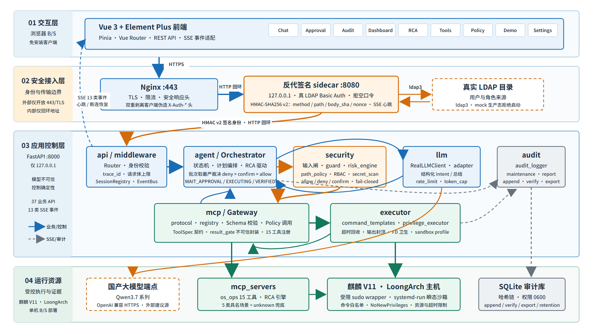
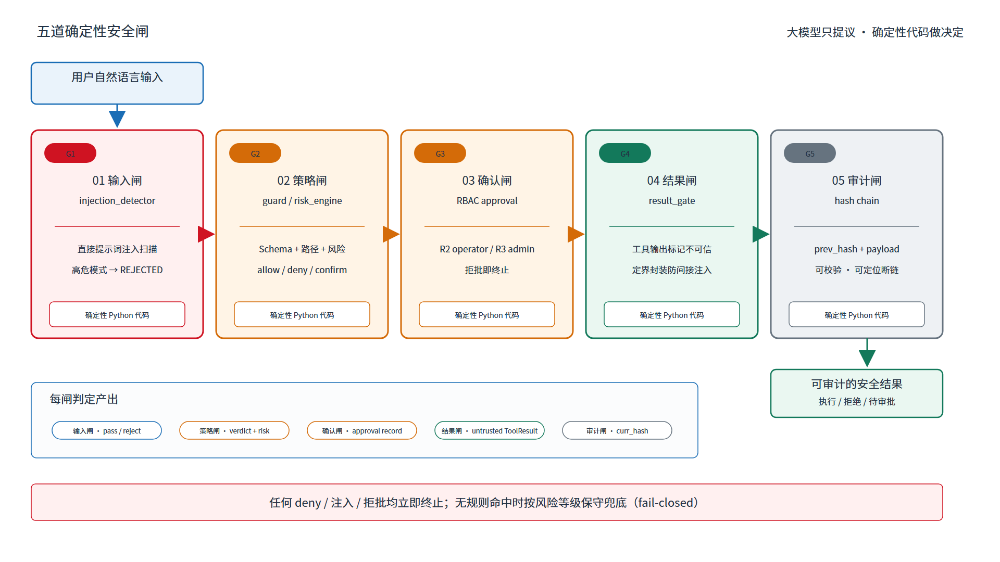

# Kylin SafeOps Agent

部署于 LoongArch + 麒麟高级服务器版 V11 的 B/S 安全智能运维 Agent。

核心叙事：把大模型当**不可信顾问**，安全由确定性代码（策略引擎 + 最小权限 + 沙箱 + 哈希链审计）兜底。
模型可以被诱导、可以幻觉、可以被日志投毒——但它只能"建议"调用哪个工具，
能不能真跑由五道确定性闸说了算，且每一步都留下不可篡改的痕迹。



## 五道安全闸

```
输入闸 → 策略闸 → 人工确认闸 → 结果闸 → 审计闸
提示注入检测  allow/deny/confirm  RBAC+签名  不可信标记  SHA-256 哈希链
```



| 闸 | 位置 | 兜底方式 |
|---|---|---|
| 输入闸 | LLM 看到输入**之前** | 确定性提示注入检测，命中 high 直接拒，不进规划 |
| 策略闸 | 每个候选工具 | 规则引擎裁决 allow / deny / confirm，取整批最严 |
| 人工确认闸 | 高危变更 | RBAC 角色校验 + HMAC 签名身份，职责分离（不许自批自） |
| 结果闸 | 工具输出回喂前 | 强制 `is_untrusted=True` + 定界符包裹，模型不得把输出当指令 |
| 审计闸 | 每个状态转移点 | SHA-256 哈希链落 SQLite，链可独立校验，改一个字节即被检出 |

## 快速开始

```bash
pip install -r backend/requirements.txt -r backend/requirements-dev.txt
KYLIN_AUTH_MODE=dev KYLIN_LLM_FAKE=true python -m uvicorn backend.app.api.app:create_app --factory --port 8000
cd frontend && npm ci && npm run dev
```

`KYLIN_AUTH_MODE=dev` 仅供本机联调——该模式下角色取自可伪造的请求头，**严禁生产**；
生产部署走 `proxy` 模式（反代注入签名身份），见 `deploy/` 与部署文档。
`KYLIN_LLM_FAKE=true` 用确定性桩替代真模型，无需配置网关即可跑通全链路。

## 仓库结构

- `backend/app/` — `contracts`(6 份冻结契约) / `llm` / `mcp` / `agent`(编排状态机) / `api` / `security` / `executor` / `audit` / `db`
- `mcp_servers/` — `os_ops`(感知与变更工具) / `rca`(根因分析引擎)
- `frontend/` `deploy/` `demo/` — 前端 / 部署（systemd + nginx + 反代 sidecar + 沙箱）/ 演示
- `third_party/` — 原样保留的 fork 源码及其 LICENSE（见 `NOTICE`）

## 交付文档

| 文档 | 内容 |
|---|---|
| [软件功能需求分析文档](docs/v2/软件功能需求分析文档.md) | 需求、场景、RBAC 模型 |
| [软件功能设计文档](docs/v2/软件功能设计文档.md) | 六层架构、状态机、五道闸、RCA 闭环 |
| [软件产品说明书](docs/v2/软件产品说明书.md) | 产品形态与使用说明 |
| [软件安装包及部署文档](docs/v2/软件安装包及部署文档.md) | 麒麟 V11 + LoongArch 部署、环境变量全表 |
| [软件功能测试报告](docs/v2/软件功能测试报告.md) | 功能测试与安全测试结论 |
| [软件性能（核心指标）测试报告](docs/v2/软件性能（核心指标）测试报告.md) | 核心指标实测数据 |

架构决策记录见 [`docs/ADR/`](docs/ADR/)（6 份，含审计选型、真 LLM 接入范围、LDAP mock 部署硬阻断等）。

## 质量数据

| 项 | 数值 |
|---|---|
| 后端用例 | 740 passed / 21 skipped（21 项为 Linux/systemd/bash 平台专属，Windows 上跳过） |
| 前端用例 | 26 passed（4 文件） |
| 质量闸 | ruff / ruff-format / mypy / pytest 四道，全部纳入 pre-commit |

数字随代码演进；以 `pre-commit run --all-files` 的当次输出为准，不以本表为准。

## 开发约定（铁律摘要）

1. 绝不 `subprocess(shell=True)`；命令只走模板白名单。
2. LLM 只输出"工具名 + 结构化参数 + 理由"的 JSON，绝不裸 shell。
3. 工具结果回喂 LLM 前包成 `ToolResult(is_untrusted=True)` 并加定界符。
4. 路径一律 canonicalize 且禁 `..` 逃逸。
5. 优先纯 Python；**前端在 x86 build**，绝不在 LoongArch 跑 npm build。

## 构建与校验

- 后端依赖：`pip install -r backend/requirements.txt`（LoongArch 上 `pydantic-core` 是唯一编译型依赖，需预编译 wheel，见部署文档）。
- 本地校验：`pre-commit run --all-files`（ruff + ruff-format + mypy + pytest）。
- CI 在 **x86** 跑；LoongArch 兼容性以真机另验，CI 不覆盖。

## 协议与模型

- **MCP 协议层**：实现 MCP 核心语义的自研轻量协议层（`backend/app/mcp/protocol.py`），
  不引入官方 `mcp` SDK——该 SDK 会传递拉入 `jsonschema→rpds-py`(Rust)、`cryptography→cffi`(C)
  等编译型依赖，与 LoongArch 离线部署的供应链约束冲突，而全仓实际只用到一个 `Tool` 类型。
- **模型**：Qwen3.7 系列，经 OpenAI 兼容网关接入（`KYLIN_LLM_MODEL` 可配）。

> 第三方来源与许可见 `NOTICE`；许可证见 `LICENSE`（Apache-2.0）。
