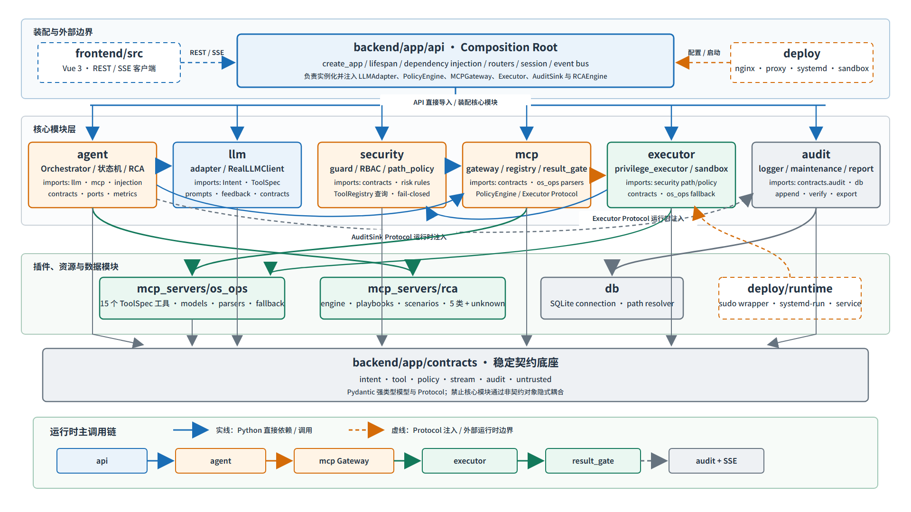
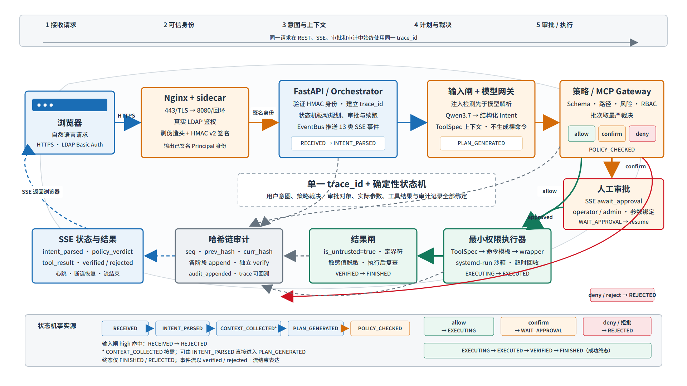
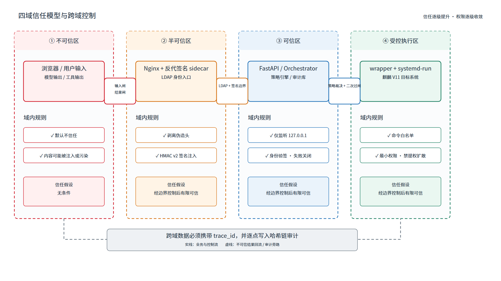
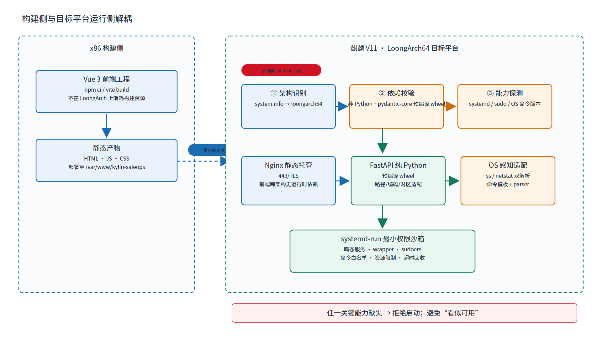
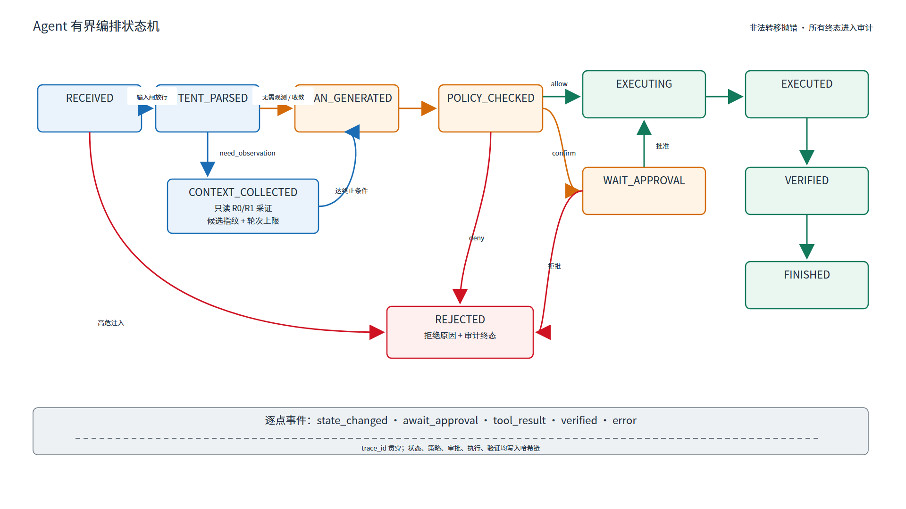
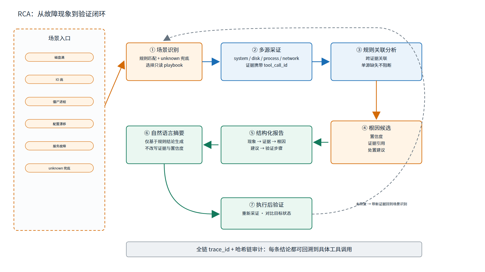
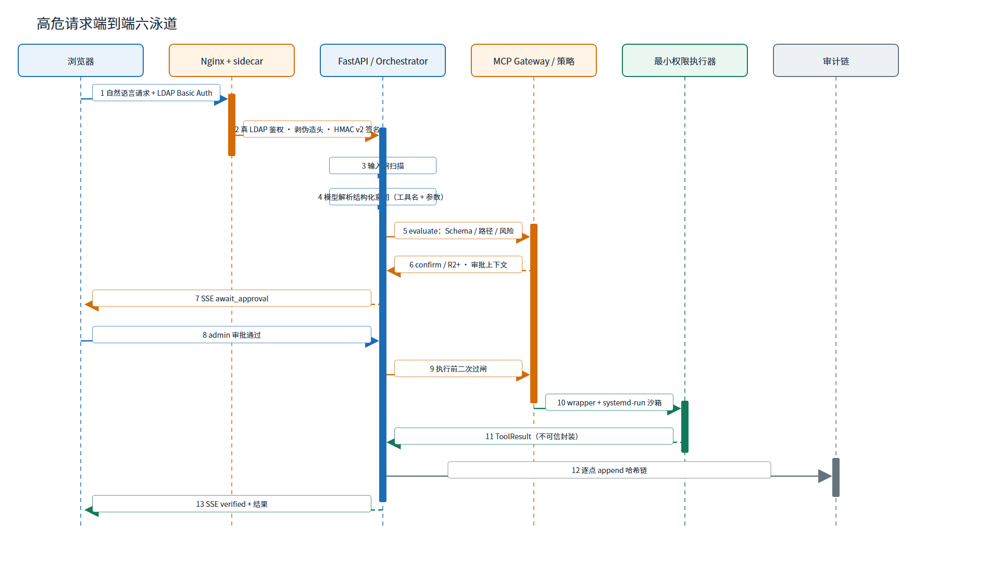
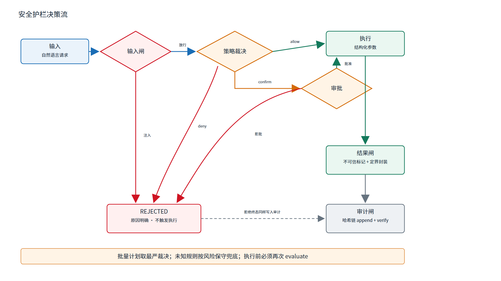

# 软件功能设计文档
**Kylin SafeOps Agent — 面向麒麟操作系统的安全智能运维 Agent**
版本：V1.1 | 基线 commit：`d8b257a`（2026-07-16）| 目标平台：银河麒麟高级服务器操作系统 V11 + LoongArch


## 修订记录

| 版本 | 日期 | 说明 |
|------|------|------|
| V1.0 | 2026-07-16 | 正式提交版；模块编号、代码路径、行为口径全面校准 |
| V1.1 | 2026-07-17 | 补 RCA service_failure 第 5 类场景；§1.4 引用版本号同步；路径去 v2 前缀；§18 自检表改正向；§16 追踪矩阵增加验证方式列 |


## 目录

1. [引言](#1-引言)
2. [设计目标、原则与关键决策](#2-设计目标原则与关键决策)
3. [B/S 总体架构](#3-bs-总体架构)
4. [LoongArch 与麒麟 V11 适配设计](#4-loongarch-与麒麟-v11-适配设计)
5. [Agent 闭环与状态机](#5-agent-闭环与状态机)
6. [安全护栏分层](#6-安全护栏分层)
7. [MCP 风格工具体系与插件设计](#7-mcp-风格工具体系与插件设计)
8. [OS 感知数据采集设计](#8-os-感知数据采集设计)
9. [自然语言识别、意图契约与会话设计](#9-自然语言识别意图契约与会话设计)
10. [智能根因分析设计](#10-智能根因分析设计)
11. [审计与追踪设计](#11-审计与追踪设计)
12. [接口与核心数据结构](#12-接口与核心数据结构)
13. [异常、超时、重试、熔断与降级](#13-异常超时重试熔断与降级)
14. [可扩展性与插件开发规范](#14-可扩展性与插件开发规范)
15. [关键时序图与流程图](#15-关键时序图与流程图)
16. [设计模块追踪矩阵（DM）](#16-设计模块追踪矩阵dm)
17. [评审评分项与设计证据映射](#17-评审评分项与设计证据映射)
18. [设计质量自检](#18-设计质量自检)
- [附录 A 模块索引](#附录-a-模块索引)
- [附录 B 接口索引](#附录-b-接口索引)
- [附录 C 核心数据结构索引](#附录-c-核心数据结构索引)
- [附录 D 工具清单（设计要点）](#附录-d-工具清单设计要点)
- [附录 E 术语与图例](#附录-e-术语与图例)


# 1 引言

## 1.1 编写目的

本文档描述 Kylin SafeOps Agent 的软件设计：总体架构、模块划分、安全护栏分层、数据结构、接口与关键流程，作为实现、测试与评审的技术依据。设计模块以 DM 编号，与《软件功能需求分析文档》的 FR/SR/NFR/IR 需求编号建立追踪关系。

## 1.2 文档范围

覆盖前端、后端 API、Agent 编排、模型网关、MCP 风格工具体系、OS 感知、根因分析、安全护栏、审计追踪、平台适配的设计。不含具体测试用例（见测试报告）与安装步骤（见部署文档）。

## 1.3 预期读者

评审专家、系统架构与开发人员、测试与运维人员。

## 1.4 设计依据

- 《软件功能需求分析文档》V1.1（FR/SR/NFR/IR/UR 需求）
- 代码基线 commit `d8b257a`
- 银河麒麟高级服务器操作系统 V11 + LoongArch 平台技术资料

## 1.5 设计编号规则

| 前缀 | 含义 |
|------|------|
| DM | 设计模块（DM-001 ~ DM-020） |
| DI | 设计接口 |
| DS | 核心数据结构 |

## 1.6 与需求文档的关系

每个 DM 标注"对应需求编号"，实现从需求到设计的正向追踪；[§16 追踪矩阵](#16-设计模块追踪矩阵dm) 给出模块—需求—代码位置的完整映射。反向追踪（需求→设计→代码→测试）见《软件功能需求分析文档》§8 与 `TRACE_MATRIX.md`。


# 2 设计目标、原则与关键决策

## 2.1 设计目标

1. **安全优先**：大模型输出必须经确定性代码校验才能落地，安全边界不依赖模型自觉。
2. **国产适配**：麒麟 V11 + LoongArch 原生运行，依赖最小化、可复现。
3. **可审计**：全过程哈希链审计，可独立校验、逐条回溯。
4. **可扩展**：工具以契约声明，新增能力不改动核心编排。

## 2.2 核心设计原则

- **模型不可信、控制确定性**：LLM 仅产出结构化意图，安全决策由 Python 代码执行。
- **最小权限**：变更类操作经最小权限沙箱执行，禁 shell / 解释器。
- **失败关闭（fail-closed）**：认证、策略、审计的关键环节在异常时一律拒绝而非放行。
- **单一事实来源**：工具契约、风险分级、审计链各有唯一权威定义。

## 2.3 关键设计决策（ADR 索引）

| 编号 | 决策 | 摘要 |
|------|------|------|
| ADR-0001 | 审计存储选型 SQLite | 单机、低依赖、哈希链完整性，适配 LoongArch 移植 |
| ADR-0002 | 模型网关 OpenAI 兼容 | 通过标准兼容接口接入国产大模型（Qwen3.7 系列） |
| ADR-0003 | MCP 薄适配自实现 | 自写薄 Tool 类型，不引入官方 SDK 的编译型传递依赖 |
| ADR-0004 | mock 模式 fail-fast | 生产模式下拒绝以 mock 身份/模型启动，多重保险 |
| ADR-0005 | 反代签名身份 v2 | HMAC 7 字段 canonical，绑定 method/path/body/nonce，防篡改防重放 |
| ADR-0006 | 默认装配真实客户端 | 默认装配 RealLLMClient，通过环境变量对接真实大模型端点 |


# 3 B/S 总体架构

## 3.1 分层架构

**图 3-1 系统分层架构。**


## 3.2 模块目录

| 目录 | 职责 |
|------|------|
| `frontend/src/` | Vue 3 前端（视图、状态、API、SSE 适配） |
| `backend/app/api/` | FastAPI 路由、依赖、中间件、事件总线、会话 |
| `backend/app/agent/` | 编排器、状态机、指标、RCA 驱动、秘密扫描 |
| `backend/app/security/` | 注入检测、策略引擎、风险引擎、路径策略、RBAC |
| `backend/app/executor/` | 最小权限执行、沙箱、命令模板 |
| `backend/app/llm/` | 模型适配器、真实客户端、提示词 |
| `backend/app/mcp/` | MCP 薄协议、注册表、网关、Schema 校验、结果闸 |
| `backend/app/audit/` | 哈希链审计、保留维护、报告 |
| `backend/app/contracts/` | 工具/意图/策略/审计/流事件契约 |
| `mcp_servers/os_ops/` | 15 个 OS 感知与变更工具 |
| `mcp_servers/rca/` | 根因分析引擎、playbook、场景 |
| `deploy/` | 反代 sidecar、LDAP、沙箱 wrapper、systemd、nginx |

**图 3-3 模块依赖关系图**



## 3.3 一次请求的数据闭环

**图 3-2 请求数据闭环。**



## 3.4 信任边界

| 信任域 | 组成 | 边界控制 |
|--------|------|---------|
| 不可信区 | 浏览器、用户输入、工具输出、模型输出 | 输入闸 + 结果闸 + 不可信标记 |
| 半可信区 | 反代 sidecar | 真 LDAP 鉴权 + 签名注入 + 剥伪造头 |
| 可信区 | FastAPI 后端、策略引擎、审计库 | 仅 127.0.0.1；签名身份校验；失败关闭 |
| 受控执行区 | 最小权限沙箱 | systemd 瞬态服务 + 命令白名单 + 禁提权扩散 |

**图 3-4 信任边界图**




# 4 LoongArch 与麒麟 V11 适配设计

## 4.1 DM-020 平台适配与插件扩展

| 属性 | 设计内容 |
|------|---------|
| 模块编号 | DM-020 |
| 模块职责 | 保障系统在麒麟 V11 + LoongArch 原生运行；工具、命令、解析、服务与依赖适配国产平台 |
| 输入 | 平台信息、依赖清单、systemd/sudo 能力、OS 命令输出 |
| 输出 | 平台画像、启动门禁结果、适配后的工具与解析 |
| 核心接口 | `system.info` 架构识别、启动期 lifespan 门禁 |
| 处理流程 | 启动检测平台 → 校验依赖与能力 → 加载适配后的命令模板与解析器 |
| 数据结构 | 平台画像、工具命令模板 |
| 权限要求 | 启动期只读检测；不改系统配置 |
| 风险控制 | mock/降级模式在生产启动期 fail-fast；架构不符显式告警 |
| 异常处理 | 关键能力缺失时启动门禁拒绝，避免"看似可用" |
| 对应需求 | NFR-014 ~ NFR-020、FR-010、FR-015 ~ FR-020 |
| 代码位置 | `backend/requirements.txt`、`mcp_servers/os_ops/`、`deploy/*.service` |

## 4.2 平台适配要点

- **架构识别**：`system.info` 采集并识别 `loongarch64`，用于确认运行在目标国产平台。
- **依赖适配**：后端以纯 Python 为主，唯一编译型依赖 pydantic-core 通过 LoongArch 预编译 wheel 部署；前端在 x86 侧构建为静态文件，由 Nginx 托管，不占用目标平台构建资源。
- **命令与解析适配**：OS 感知工具的命令模板与解析器适配麒麟 V11 的系统工具输出（如 `network.ports` 支持 ss/netstat 双变体）。
- **服务与隔离适配**：systemd 单元、sudoers 与 systemd-run 沙箱适配麒麟 V11 的服务管理与内核隔离能力。
- **编码与时间**：路径、日志、编码与时区按麒麟 V11 默认环境适配。

**图 4-1 LoongArch+麒麟 V11 适配示意**




# 5 Agent 闭环与状态机

## 5.1 DM-006 Agent 编排与状态机

| 属性 | 设计内容 |
|------|---------|
| 模块编号 | DM-006 |
| 模块职责 | 串联输入闸、规划、只读观测、再规划、策略、审批、执行、验证、RCA、审计与事件反馈 |
| 输入 | 消息序列、user_intent、LLMAdapter、MCPGateway、AuditSink、EventSink、RCAEngine |
| 输出 | 终态 / WAIT_APPROVAL、StreamEvent、AuditRecord、ToolResult、RCA 报告 |
| 核心接口 | `Orchestrator.run(messages, user_intent)`、`resume(approved)`、`MCPGateway.evaluate/call` |
| 处理流程 | RECEIVED → 输入闸 → Intent → 有界观测/再规划 → 原子策略 → 审批/拒绝/执行 → 退出码验证 → RCA → FINISHED |
| 数据结构 | `State`、`Intent`、`CandidateTool`、`PolicyVerdict`、`ToolResult`、`AuditRecord` |
| 权限要求 | Orchestrator 不持 OS 权限；审批角色由 API Principal 校验 |
| 风险控制 | 非法状态转移抛错；观测仅 R0/R1；多工具取最严裁决；执行前二次过闸；结果只以不可信形态流转 |
| 异常处理 | 模型网络/配额错误产生 error 事件；观测单工具异常跳过；执行系统异常终止；Runner 兜底关流 |
| 对应需求 | FR-028 ~ FR-037、FR-050 ~ FR-057、SR-002、SR-010 ~ SR-014 |
| 代码位置 | `backend/app/agent/orchestrator.py`、`state_machine.py` |

## 5.2 状态机



**图 5-1 Agent 状态机。**

## 5.3 有界观察—再规划

对于需要先观测再决策的请求，Orchestrator 在只读工具（R0/R1）范围内采集证据，将结果以不可信形态回喂模型再规划；通过候选指纹与轮次上限保证收敛，避免无限循环。

## 5.4 原子多工具计划与执行后验证

一次计划中的多个工具按最严风险裁决整体处理；执行完成后依据退出码验证目标状态并产出结论，全过程逐点进入哈希链审计。


# 6 安全护栏分层

## 6.1 总体防御模型

安全护栏是本系统的核心设计，采用五道确定性安全闸层层收敛风险：


**图 6-1 五道安全闸。** 每一道均为确定性代码，大模型无法绕过。

## 6.2 DM-013 策略、风险与路径控制

| 属性 | 设计内容 |
|------|---------|
| 模块编号 | DM-013 |
| 模块职责 | 对每次工具调用做 allow/deny/confirm 裁决；风险分级；受保护路径与危险参数控制 |
| 输入 | 工具名、结构化参数、ToolSpec 风险、策略规则集 |
| 输出 | PolicyVerdict（决策 + 风险 + 审批角色 + 理由 + 安全替代） |
| 核心接口 | `guard.evaluate(tool, args, policy, spec)`、`risk_engine.default_decision_for_risk` |
| 处理流程 | 参数危险值检测 → ProtectedPaths 校验 → 规则匹配 → 按风险给默认裁决 → 取最严 |
| 数据结构 | `PolicySet`、`PolicyRule`、`PolicyVerdict`、`RiskLevel` |
| 权限要求 | 纯判定，无 OS 权限 |
| 风险控制 | 危险参数值 + 受保护路径 + 风险分级三重判定；无命中时按风险保守兜底 |
| 异常处理 | 规则/Schema 异常时失败关闭（deny） |
| 对应需求 | SR-002、SR-005 ~ SR-007、SR-010、SR-014、NFR-003 |
| 代码位置 | `backend/app/security/guard.py`、`risk_engine.py`、`policy_rules.py`、`policy_loader.py`、`path_policy.py` |

## 6.3 DM-014 注入防护与不可信结果闸

| 属性 | 设计内容 |
|------|---------|
| 模块编号 | DM-014 |
| 模块职责 | 输入闸检测直接提示词注入；结果闸对工具输出标记不可信并加定界符，隔离间接注入 |
| 输入 | 用户输入文本、工具执行结果 |
| 输出 | 注入判定、包装为不可信形态的 ToolResult |
| 核心接口 | `injection_detector` 扫描、`result_gate` 包装、`feedback.GUARD_PROMPT` |
| 处理流程 | 输入闸前置扫描（拦在规划前）→ 工具结果标 `is_untrusted` + 定界符 → 回喂模型时守卫句包裹 |
| 数据结构 | `ToolResult(is_untrusted, wrap_token)`、注入规则集 |
| 权限要求 | 纯处理，无 OS 权限 |
| 风险控制 | 直接注入前置拦截；间接注入（日志投毒）经不可信标记 + 策略闸兜底双重防御 |
| 异常处理 | 检测异常时从严处理 |
| 对应需求 | SR-003、SR-004、SR-018、SR-020 |
| 代码位置 | `backend/app/security/injection_detector.py`、`backend/app/mcp/result_gate.py`、`backend/app/llm/feedback.py` |

## 6.4 DM-015 最小权限执行与沙箱

| 属性 | 设计内容 |
|------|---------|
| 模块编号 | DM-015 |
| 模块职责 | 变更类工具经最小权限沙箱执行；命令白名单；禁 shell / 解释器；禁提权扩散 |
| 输入 | 工具名、校验后参数、执行 profile |
| 输出 | ToolResult（退出码、截断输出、不可信标记） |
| 核心接口 | `PrivilegeExecutor`、`deploy/sandbox/kylin-safeops-run.sh` |
| 处理流程 | 参数注入式转义 → sudo 调 wrapper → systemd-run 瞬态服务施加隔离属性 → 白名单校验 inner 命令 → 执行 → 结果标准化 |
| 数据结构 | `command_templates`、执行 profile（readonly / limited_write） |
| 权限要求 | 仅 wrapper 经 sudoers 放行；inner 命令限白名单二进制 |
| 风险控制 | systemd-run 瞬态服务真隔离；NoNewPrivileges 施加到被执行工具；超时杀进程 + 流式封顶 + FD 卫生 |
| 异常处理 | 超时中止 + 审计；非白名单命令拒绝；系统异常终止 |
| 对应需求 | FR-030 ~ FR-032、FR-051、SR-009、SR-012 ~ SR-014、NFR-017 |
| 代码位置 | `backend/app/executor/privilege_executor.py`、`sandbox.py`、`command_templates.py`、`deploy/sandbox/kylin-safeops-run.sh`、`deploy/sandbox/kylin-safeops-sudoers` |

## 6.5 DM-016 高危审批与阻断

| 属性 | 设计内容 |
|------|---------|
| 模块编号 | DM-016 |
| 模块职责 | 高危（R2+）操作的人工审批、阻断、职责分离 |
| 输入 | 审批请求、Principal、approval_role |
| 输出 | 审批结论（批准/拒绝/升级）、resume 续跑 |
| 核心接口 | approvals router、`Orchestrator.resume`、`rbac.can_approve` |
| 处理流程 | 策略 confirm → WAIT_APPROVAL → 审批人身份校验 → can_approve 判定 → 批准后 resume 执行 |
| 数据结构 | 审批批次、approval_role、Principal |
| 权限要求 | operator 批 operator 级；admin 批 operator+admin 级；其余拒绝 |
| 风险控制 | 审批一次性、防重放；审批对象与实际参数一致；职责分离 |
| 异常处理 | 角色不符拒绝；审批状态异常失败关闭 |
| 对应需求 | FR-029 ~ FR-032、FR-041 ~ FR-043、FR-046、SR-010 ~ SR-014 |
| 代码位置 | `backend/app/api/routers/approvals.py`、`backend/app/security/rbac.py`、`backend/app/agent/orchestrator.py` |


# 7 MCP 风格工具体系与插件设计

## 7.1 MCP 风格内部体系范围

本系统实现"面向运维工具的 MCP 风格内部调用体系"，提供工具规范、注册、发现、Schema 校验、调用控制与结果封装。调用链为：

```
ToolSpec（契约） → Registry（注册） → Gateway（三道闸） → Schema 校验 → Policy 裁决 → Executor（最小权限） → ResultGate（不可信封装）
```

标准 MCP transport（stdio / Streamable HTTP）与第三方客户端互操作作为规划中的扩展方向，本系统内部体系已通过薄协议层预留 ToolSpec ↔ MCP Tool 的形态转换能力。

## 7.2 DM-009 MCP 薄协议与工具注册

| 属性 | 设计内容 |
|------|---------|
| 模块编号 | DM-009 |
| 模块职责 | 定义薄 Tool 类型；ToolSpec ↔ MCP Tool 形态转换；工具注册与发现 |
| 输入 | 各工具 ToolSpec |
| 输出 | 注册表、能力清单、MCP Tool 形态 |
| 核心接口 | `all_specs()`、`ToolRegistry.list_tools/get`、`protocol.to_mcp_tool/from_mcp_tool` |
| 处理流程 | 加载 ToolSpec → 校验唯一性与元数据 → 注册 → 提供发现 |
| 数据结构 | `ToolSpec`、`Tool`（薄类型） |
| 权限要求 | 用户只见有权发现的工具 |
| 风险控制 | 重名拒绝；缺元数据外部工具取最保守默认 |
| 异常处理 | 非法 Schema / 缺元数据不注册并记录 |
| 对应需求 | FR-012、FR-015 ~ FR-020、IR-003、NFR-010 |
| 代码位置 | `backend/app/mcp/protocol.py`、`registry.py`、`mcp_servers/os_ops/__init__.py` |

## 7.3 DM-010 MCP Gateway 与工具授权

| 属性 | 设计内容 |
|------|---------|
| 模块编号 | DM-010 |
| 模块职责 | 工具调用的统一入口：注册校验 + Schema 校验 + 策略裁决三道闸 |
| 输入 | 工具名、参数、身份上下文 |
| 输出 | 执行结果或带裁决/原因的未执行结果 |
| 核心接口 | `MCPGateway.evaluate(...)`、`MCPGateway.call(...)`、`schema_validator` |
| 处理流程 | 命中注册表 → Schema 校验（禁附加字段/禁 `..`）→ 策略裁决 → 放行执行或返回裁决 |
| 数据结构 | `ToolSpec`、`PolicyVerdict`、`ToolResult` |
| 权限要求 | 高危工具经 risk → approval_role → 审批闸约束 |
| 风险控制 | 变更工具不能经只读接口旁路审批；执行前二次过闸 |
| 异常处理 | 校验失败即停，执行器调用 0 次 |
| 对应需求 | FR-013 ~ FR-014、FR-041、SR-006 ~ SR-008、IR-003 |
| 代码位置 | `backend/app/mcp/gateway.py`、`schema_validator.py` |

## 7.4 插件生命周期与扩展

新增工具只需声明 ToolSpec（name/description/risk/input_schema/requires_roles/reversible），经注册期校验后即可加入注册表；变更类工具须声明为 R2+ 并接入审批与沙箱。核心编排逻辑无需改动。


# 8 OS 感知数据采集设计

## 8.1 DM-011 OS 感知插件与结构化解析

| 属性 | 设计内容 |
|------|---------|
| 模块编号 | DM-011 |
| 模块职责 | 通过只读/轻量工具采集麒麟主机状态并结构化解析；每条结果带来源与采集时间 |
| 输入 | 工具名、结构化参数 |
| 输出 | 结构化采集结果 + 数据来源状态 + 采集时间 |
| 核心接口 | `os_ops` 各 `tools_*.py` 的采集函数、解析器 |
| 处理流程 | 命令模板执行 → 解析器结构化 → 标注来源/时间/状态 → 不可信封装 |
| 数据结构 | `ToolResult`、各工具输出模型 |
| 权限要求 | 只读工具无需提权（R0/R1） |
| 风险控制 | 不用示例值/缓存冒充实时；单指标失败降级不影响其他 |
| 异常处理 | 采样失败标记该指标不可用；首选工具缺失切备选变体 |
| 对应需求 | FR-001 ~ FR-011、FR-027 ~ FR-028、NFR-015、NFR-018 |
| 代码位置 | `mcp_servers/os_ops/`（tools_system/disk/process/network/log/file/service/config + dispatch/parsers/fallback） |

## 8.2 采集流水线与系统概览

采集流水线：参数校验 → 命令模板执行 → 结构化解析 → 来源/时间标注 → 结果封装。系统概览页聚合 CPU / 内存 / 磁盘核心指标并展示近期趋势，采集口径统一、单位与时间可见。工具清单与命令映射见 [附录 D](#附录-d-工具清单设计要点)。


# 9 自然语言识别、意图契约与会话设计

## 9.1 DM-007 模型网关与结构化意图

| 属性 | 设计内容 |
|------|---------|
| 模块编号 | DM-007 |
| 模块职责 | 封装大模型调用；将自然语言解析为结构化意图；限速与 token 预算控制 |
| 输入 | 消息序列、工具目录、user_intent |
| 输出 | Intent（工具名 + 参数 + 理由 + 风险提示），绝不输出裸 shell |
| 核心接口 | `LLMAdapter`、`RealLLMClient.completion_fn/summarize`、`load_real_llm_config_from_env` |
| 处理流程 | 装配 RealLLMClient → 组装工具目录提示 → 调用端点 → 产出结构化 JSON → Schema 校验 |
| 数据结构 | `Intent`、`CandidateTool`、`RealLLMConfig` |
| 权限要求 | API 密钥仅经环境注入，绝不入库 |
| 风险控制 | 限速 + token 预算；结构化输出经 ToolSpec 校验；送模型前 S9 敏感过滤 |
| 异常处理 | 模型调用失败产生 error 事件；不产生虚假结论 |
| 对应需求 | FR-021 ~ FR-026、IR-005、NFR-002 |
| 代码位置 | `backend/app/llm/adapter.py`、`real_client.py`、`prompts.py` |

## 9.2 模型运行模式（配置 → 行为）

系统默认装配 `RealLLMClient`，通过环境变量对接真实大模型端点（Qwen3.7 系列等 OpenAI 兼容端点）。运行模式一览：

| 配置 | 客户端 | 行为 | 用途与识别 |
|------|--------|------|-----------|
| 生产（`KYLIN_LLM_PROVIDER=real`，经环境变量对接） | RealLLMClient | 对接真实大模型端点 `{base_url}/chat/completions` | 生产/演示；设置页显示"真实端点模式" |
| `KYLIN_LLM_PROVIDER=fixture` | RealLLMClient(fixture) | 确定性内置响应，不联网 | 开发联调/离线演示；界面显著标识"测试桩" |
| `KYLIN_LLM_FAKE=true` | Fake 客户端 | 关键词确定性响应，不联网 | 单元测试/离线演示；界面标识"Fake" |

模型健康可经 `GET /api/llm/health?probe=true` 主动探测（不回显密钥）。**Mock / 测试桩模式在界面有显著标识，其结果不用于证明真实模型能力。**

## 9.3 DM-008 会话与上下文管理

| 属性 | 设计内容 |
|------|---------|
| 模块编号 | DM-008 |
| 模块职责 | 管理会话所有权、上下文与实体，支持多轮追问 |
| 输入 | session_id、Principal、历史消息、证据摘要 |
| 输出 | 经所有权校验与脱敏的上下文 |
| 核心接口 | `SessionStore`、`session_registry` |
| 处理流程 | 校验所有者 → 加载上下文 → 范围筛选 → 脱敏 → 交模型 |
| 数据结构 | 会话记录、上下文快照 |
| 权限要求 | 会话与证据绑定 owner，防 IDOR |
| 风险控制 | 工具输出仅保留摘要与引用；历史注入不获指令效力；跨用户/会话不拼接 |
| 异常处理 | 指代歧义时提问；所有权校验失败拒绝并审计 |
| 对应需求 | FR-023 ~ FR-024、FR-042、SR-004、SR-015、SR-019 |
| 代码位置 | `backend/app/api/session_store.py`、`session_registry.py`、`deps.py`（principal_for_idor） |


# 10 智能根因分析设计

## 10.1 DM-012 RCA、关联分析与规则知识

| 属性 | 设计内容 |
|------|---------|
| 模块编号 | DM-012 |
| 模块职责 | 识别故障场景，多源采证关联，输出根因候选与结构化报告 |
| 输入 | 故障现象、trace、多工具证据 |
| 输出 | RCA 报告（现象—证据—根因候选—建议—验证），证据可引用 |
| 核心接口 | `RCAEngine.analyze`、`rca_drive`、`rca_summary_llm`、`/api/rca/*` |
| 处理流程 | 场景识别 → playbook 驱动采证 → 规则关联 → 根因候选 + 置信度 → 结构化报告 + 自然语言摘要 |
| 数据结构 | RCA 报告、场景 playbook、证据引用 |
| 权限要求 | 采证阶段只读；处置建议经审批 |
| 风险控制 | 报告基于规则引擎结论，模型摘要在规则结论上生成 |
| 异常处理 | 单源证据缺失不阻断整体分析 |
| 对应需求 | FR-033 ~ FR-037、NFR-004、SR-004、SR-020 |
| 代码位置 | `mcp_servers/rca/engine.py`、`playbooks.py`、`scenarios.py`、`backend/app/agent/rca_drive.py`、`rca_summary_llm.py` |

## 10.2 RCA 流程与场景分类



**图 10-1 RCA 闭环。** 覆盖 5 类具名场景（磁盘满、IO 高、僵尸进程、配置漂移、服务故障）+ unknown 兜底；根因报告的每条证据可回溯到具体工具调用。


# 11 审计与追踪设计

## 11.1 DM-017 审计哈希链与存储

| 属性 | 设计内容 |
|------|---------|
| 模块编号 | DM-017 |
| 模块职责 | 全过程审计以 SQLite 哈希链记录，支持查询、导出、完整性校验 |
| 输入 | 各阶段 AuditRecord |
| 输出 | 哈希链记录、查询结果、校验结论 |
| 核心接口 | `SqliteAuditSink.append`、`verify_chain`、`/api/audit/*` |
| 处理流程 | 每个状态转移点产记录 → 计算 `sha256(prev_hash + payload)` → append → 查询/校验/导出 |
| 数据结构 | `AuditRecord(seq, prev_hash, curr_hash, phase, payload)` |
| 权限要求 | 审计查询/导出限 auditor/admin |
| 风险控制 | 记录不含明文密钥（S9 过滤）；导出脱敏；DB 路径受控 |
| 异常处理 | 审计不可用时安全降级，不静默丢链 |
| 对应需求 | FR-044 ~ FR-049、FR-056、SR-015 ~ SR-019、NFR-006 |
| 代码位置 | `backend/app/audit/audit_logger.py`、`maintenance.py`、`backend/app/api/routers/audit.py` |

## 11.2 追踪标识与链完整性

每次请求分配全链路 trace_id 并绑定用户；从任一结果可回溯发起用户、意图、策略、审批、执行参数与验证结论。哈希链支持一键校验，篡改可定位断链位置；审计记录以 lifespan 单例维护链状态，保证跨请求链连续。


# 12 接口与核心数据结构

## 12.1 DM-003 FastAPI 接口与契约边界

| 属性 | 设计内容 |
|------|---------|
| 模块编号 | DM-003 |
| 模块职责 | 定义 REST + SSE 接口、请求/响应契约、统一错误与健康端点 |
| 输入 | HTTP 请求、签名身份头 |
| 输出 | Pydantic DTO 响应、SSE 事件流、统一错误结构 |
| 核心接口 | 11 Router，37 业务 API |
| 处理流程 | 中间件（trace_id + 体上限）→ 依赖鉴权 → 路由处理 → DTO 响应 |
| 数据结构 | 各 Router 的 Request/Response schema |
| 权限要求 | 全量业务端点经 `verify_token`；审批/审计经 `require_proxy_identity` / `require_role` |
| 风险控制 | 契约 extra=forbid；请求体上限；就绪探针无鉴权（故意） |
| 异常处理 | 统一错误响应；缺签名身份 401 |
| 对应需求 | FR-038、FR-040、FR-050、IR-001、IR-007 |
| 代码位置 | `backend/app/api/routers/`、`schemas.py`、`deps.py`、`middleware.py` |

## 12.2 接口清单概览

系统提供 **37 个业务 API + 4 个文档路由**（文档路由：`/openapi.json`、`/docs`、`/docs/oauth2-redirect`、`/redoc`）。业务 API 分 11 组：

| 组 | 数量 | 鉴权 |
|----|:---:|------|
| chat / sessions | 7 | principal_for_idor（events: verify_token） |
| approvals | 6 | require_proxy_identity |
| audit | 4 | require_proxy_identity（+auditor） |
| tools | 4 | verify_token / require_proxy_identity |
| system | 5 | verify_token（ready 无鉴权探针） |
| policy | 3 | require_proxy_identity（+auditor） |
| demo | 3 | require_proxy_identity |
| rca | 2 | verify_token |
| llm | 2 | verify_token |
| auth | 1 | handler 内校验 |

## 12.3 SSE 事件契约（DI）

SSE 事件类型共 13 种：`intent_parsed`、`observation`、`plan_generated`、`policy_verdict`、`await_approval`、`executing`、`tool_result`、`verified`、`rejected`、`rca`、`natural_language`、`audit_appended`、`error`。任务终态由流结束配合 `verified` / `rejected` 表达。

`POST /api/tools/call` 请求体字段为 `tool`（工具名）+ `args`（参数对象）。

## 12.4 核心数据结构（DS）

| 数据结构 | 用途 | 定义位置 |
|---------|------|---------|
| `ToolSpec` | 工具静态契约 | `backend/app/contracts/tool.py` |
| `Intent` / `CandidateTool` | 结构化意图 | `backend/app/contracts/intent.py` |
| `PolicyVerdict` / `PolicySet` | 策略裁决 | `backend/app/contracts/`、`security/` |
| `ToolResult` | 工具结果（含 is_untrusted / wrap_token） | `backend/app/contracts/` |
| `AuditRecord` | 审计链记录 | `backend/app/contracts/audit.py` |
| `StreamEvent` | SSE 事件 | `backend/app/contracts/stream.py` |

## 12.5 DM-018 数据、缓存与消息机制

| 属性 | 设计内容 |
|------|---------|
| 模块编号 | DM-018 |
| 模块职责 | 数据载体（SQLite）、缓存（TTL）、消息（事件总线队列）的职责边界 |
| 输入 | 审计记录、概览数据、SSE 事件 |
| 输出 | 持久审计、有界缓存、按 trace 分发的事件流 |
| 核心接口 | `SqliteAuditSink`、`EventBus`、概览缓存 |
| 处理流程 | 审计落 SQLite；概览有界缓存；事件按 trace_id 队列分发 + 心跳 |
| 数据结构 | SQLite 表、内存队列、TTL 缓存 |
| 权限要求 | 审计 DB 路径受控 |
| 风险控制 | 事务边界；队列容量背压保护；连接上限 |
| 异常处理 | 队列满 raise 并兜底；数据源故障隔离 |
| 对应需求 | FR-006 ~ FR-009、FR-044 ~ FR-056、NFR-012 |
| 代码位置 | `backend/app/audit/audit_logger.py`、`backend/app/api/event_bus.py`、`backend/app/api/_redis_nonce_store.py` |


# 13 异常、超时、重试、熔断与降级

## 13.1 DM-019 异常、健康与降级控制

| 属性 | 设计内容 |
|------|---------|
| 模块编号 | DM-019 |
| 模块职责 | 统一错误分类、任务终态、超时预算、背压、健康检查与降级 |
| 输入 | 各环节异常、超时事件、健康探测 |
| 输出 | 明确任务终态、error 事件、健康状态、降级响应 |
| 核心接口 | `Runner`、执行超时、`/api/llm/health`、`/api/system/ready` |
| 处理流程 | 分类错误 → 明确终态（FINISHED/REJECTED/WAIT_APPROVAL）→ 背压/限流 → 前端可解释 |
| 数据结构 | 错误分类、任务终态 |
| 权限要求 | 无 |
| 风险控制 | 模型/工具/SSE/审批/审计故障均有确定终态；无重复变更；安全关键故障关闭变更 |
| 异常处理 | 超时杀进程 + 审计；SSE 断连可恢复；审计故障 fail-safe |
| 对应需求 | FR-050 ~ FR-057、IR-007、NFR-001、NFR-005、NFR-011 ~ NFR-012 |
| 代码位置 | `backend/app/api/runner.py`、`backend/app/agent/state_machine.py`、`backend/app/api/routers/llm.py`、`system.py` |

## 13.2 超时、幂等与背压

工具执行有超时预算，超时中止并审计；SSE 断连重连不产生重复变更（幂等）；事件总线队列满时背压保护，防止事件无限堆积。


# 14 可扩展性与插件开发规范

## 14.1 插件分层与规范

工具以 ToolSpec 契约声明，包含：`name`（唯一）、`description`、`risk`（R0–R4）、`input_schema`（强类型 JSON Schema，禁任意路径/命令）、`requires_roles`、`reversible`。变更类工具须声明为 R2+ 并接入策略、审批与沙箱。

## 14.2 注册门禁与调用隔离

新增工具经注册期校验（唯一性、元数据完整、Schema 合法）后进入注册表；缺元数据的外部工具取最保守默认（最高风险 + admin）。工具调用异常在 Gateway 层隔离，不影响其他工具与整体编排。

## 14.3 扩展目录职责

| 扩展类型 | 目录 |
|---------|------|
| OS 感知/变更工具 | `mcp_servers/os_ops/tools_*.py` |
| RCA 场景 / playbook | `mcp_servers/rca/` |
| 策略规则 | `backend/app/security/policy_rules.py` |


# 15 关键时序图与流程图

## 15.1 高危请求端到端时序



**图 15-1 高危请求时序。**

## 15.2 安全护栏决策流



**图 15-2 安全护栏决策流。**


# 16 设计模块追踪矩阵（DM）

基于 commit `d8b257a` 重建，每个 DM 的代码位置均在当前代码存在。完整需求—设计—代码—测试逐行映射见 `TRACE_MATRIX.md`。

| DM | 模块名称 | 对应需求 | 代码位置 | 验证方式 |
|----|---------|---------|---------|---------|
| DM-001 | 前端表现与业务组件 | UR-001、UR-012、FR-025、FR-027 ~ FR-029、NFR-007 ~ NFR-008 | `frontend/src/views`、`components` | `vitest` 26 项通过（EV-06）；平台专项 E-P-001 |
| DM-002 | 前端状态、REST 与 SSE 适配 | FR-023 ~ FR-026、FR-050、FR-054、IR-001 ~ IR-002 | `frontend/src/stores`、`api`、`types` | `vitest`（EV-06）；`test_api_event_bus.py` |
| DM-003 | FastAPI 接口与契约边界 | FR-038、FR-040、FR-050、IR-001、IR-007 | `backend/app/api/routers`、`schemas.py` | `test_api_endpoints.py`、`test_auth.py`（EV-02/03） |
| DM-004 | 身份代理、LDAP 与 Principal | SR-001、SR-017、FR-038 ~ FR-040、IR-006 | `deploy/proxy`、`deploy/sso`、`backend/app/api/auth.py` | `test_hmac_canonical_v2.py`、`test_deps_v2_proxy_verify.py`；平台专项 E-P-003（EV-03/10） |
| DM-005 | 会话、任务与事件总线 | FR-023、FR-042、FR-050、FR-054、IR-002 | `backend/app/api/session_store.py`、`session_registry.py`、`event_bus.py` | `test_api_event_bus.py`、`test_chat_state_consistency.py`（EV-12） |
| DM-006 | Agent 编排与状态机 | FR-021 ~ FR-037、FR-050、SR-002、SR-014 | `backend/app/agent/orchestrator.py`、`state_machine.py` | `test_orchestrator.py`、`test_planner.py`（EV-04/11） |
| DM-007 | 模型网关与结构化意图 | FR-021 ~ FR-026、IR-005、NFR-002 | `backend/app/llm/adapter.py`、`real_client.py`、`prompts.py` | `test_llm_adapter.py`、`test_completion_fn.py`、`test_get_llm_record_mode.py`（EV-04） |
| DM-008 | 多轮上下文与会话 | FR-023 ~ FR-024、FR-042、SR-015、SR-020 | `backend/app/api/session_store.py`、`deps.py` | `test_chat_state_consistency.py`（EV-02） |
| DM-009 | MCP 薄协议与工具注册 | FR-012、FR-015 ~ FR-020、IR-003、NFR-010 | `backend/app/mcp/protocol.py`、`registry.py` | `test_contracts.py`、`test_mcp_gateway.py`（EV-01/02） |
| DM-010 | Gateway 与工具授权 | FR-013 ~ FR-014、FR-041、SR-006 ~ SR-008、IR-003 | `backend/app/mcp/gateway.py`、`schema_validator.py` | `test_mcp_gateway.py`、`test_change_tools_guard.py`（EV-02/13） |
| DM-011 | OS 感知插件与解析 | FR-001 ~ FR-011、FR-027 ~ FR-028、NFR-015、NFR-018 | `mcp_servers/os_ops/` | `test_os_ops_system_disk.py`、`test_os_ops_process_network.py` 等（EV-01）；平台专项 E-P-001 |
| DM-012 | RCA 与规则知识 | FR-033 ~ FR-037、NFR-004、SR-004、SR-020 | `mcp_servers/rca/`、`backend/app/agent/rca_drive.py`、`rca_summary_llm.py` | `mcp_servers/rca/tests/test_playbooks.py`、`test_rca.py`、`test_rca_router_e2e.py`（EV-04/11） |
| DM-013 | 策略、风险与路径控制 | SR-002、SR-005 ~ SR-007、SR-010、SR-014、NFR-003 | `backend/app/security/guard.py`、`risk_engine.py`、`policy_rules.py`、`path_policy.py` | `test_policy.py`、`test_change_tools_guard.py`（EV-13） |
| DM-014 | 注入防护与不可信结果闸 | SR-003 ~ SR-004、SR-018、SR-020 | `backend/app/security/injection_detector.py`、`backend/app/mcp/result_gate.py`、`backend/app/llm/feedback.py` | `test_injection_detector.py`、`test_indirect_injection.py`、`test_injection_conspiracy.py`（EV-04/13） |
| DM-015 | 最小权限执行与沙箱 | FR-030 ~ FR-032、FR-051、SR-009、SR-012 ~ SR-014、NFR-017 | `backend/app/executor/privilege_executor.py`、`sandbox.py`、`command_templates.py`、`deploy/sandbox/` | `test_executor.py`（EV-05）；`test_sandbox.py`（NNP 分层设计已核对；Linux/VM 完整验证，平台专项 E-P-008） |
| DM-016 | 高危审批与阻断 | FR-029 ~ FR-032、FR-041 ~ FR-043、FR-046、SR-010 ~ SR-014 | `backend/app/api/routers/approvals.py`、`backend/app/security/rbac.py` | `test_rbac_wiring.py`、`test_audit_proxy_role.py`、`test_b2_auth_layer.py`（EV-13） |
| DM-017 | 审计哈希链与追踪 | FR-044 ~ FR-049、FR-056、SR-015 ~ SR-019、NFR-006 | `backend/app/audit/audit_logger.py`、`maintenance.py`、`backend/app/api/routers/audit.py` | `test_audit.py`、`test_audit_wiring.py`、`test_audit_durability.py`（EV-05） |
| DM-018 | 数据、缓存与消息机制 | FR-006 ~ FR-009、FR-044 ~ FR-056、NFR-012 | `backend/app/audit/`、`backend/app/api/event_bus.py` | `test_event_bus_queue.py`、`test_lifespan_drain.py`（EV-12） |
| DM-019 | 异常、健康与降级控制 | FR-050 ~ FR-057、IR-007、NFR-001、NFR-005、NFR-011 ~ NFR-012 | `backend/app/api/runner.py`、`backend/app/agent/state_machine.py` | `test_orchestrator.py`、`test_event_bus_queue.py`（EV-11） |
| DM-020 | 平台适配与插件扩展 | FR-010、FR-015 ~ FR-020、NFR-013 ~ NFR-020 | `backend/requirements.txt`、`mcp_servers/os_ops/`、`deploy/*.service` | `test_install_sh_dry_run.py`；平台专项 E-P-001（EV-08/14） |

## 16.2 需求域覆盖检查

| 需求域 | 设计模块 | 覆盖 |
|--------|---------|------|
| FR-001 ~ FR-011 OS 感知 | DM-011、DM-020 | ✅ |
| FR-012 ~ FR-020 MCP/插件 | DM-009、DM-010、DM-020 | ✅ |
| FR-021 ~ FR-026 自然语言/上下文 | DM-006 ~ DM-008 | ✅ |
| FR-027 ~ FR-032 查询诊断执行 | DM-006、DM-011、DM-015、DM-016 | ✅ |
| FR-033 ~ FR-037 RCA | DM-012 | ✅ |
| FR-038 ~ FR-043 用户权限 | DM-003 ~ DM-005、DM-010、DM-016 | ✅ |
| FR-044 ~ FR-049 审计 | DM-017 | ✅ |
| FR-050 ~ FR-057 异常恢复 | DM-018、DM-019 | ✅ |
| SR-001 ~ SR-020 安全 | DM-004、DM-010、DM-013 ~ DM-017 | ✅ |
| IR-001 ~ IR-007 接口 | DM-003、DM-009、DM-010 | ✅ |
| NFR-001 ~ NFR-020 非功能 | DM-018 ~ DM-020 | ✅ |


# 17 评审评分项与设计证据映射

| 评审维度 | 权重 | 对应设计 | 设计证据 |
|---------|:---:|---------|---------|
| 功能完整性—OS 感知 | 55% 内 | DM-011、DM-020 | 15 工具采集与解析设计 |
| 功能完整性—MCP 工具体系 | 55% 内 | DM-009、DM-010 | 三道闸调用链 + 注册表 |
| 功能完整性—自然语言识别 | 55% 内 | DM-006 ~ DM-008 | 结构化意图契约 + 状态机 |
| 功能完整性—安全护栏 | 55% 内 | DM-013 ~ DM-016 | 五道闸分层设计 |
| 功能完整性—根因分析 | 55% 内 | DM-012 | RCA 闭环设计 |
| 创新—相对传统方案 | 25% 内 | §2、§6 | 不可信顾问 + 确定性地板 |
| 创新—国产化适配 | 25% 内 | DM-020、§4 | 麒麟 V11 + LoongArch 原生 |
| 创新—多技术协同 | 25% 内 | DM-006、DM-012、DM-017 | 模型 + 规则 + 哈希链审计 |
| 创新—可扩展性 | 25% 内 | DM-009、§14 | ToolSpec 契约化插件 |
| 文档结构完整 | 20% 内 | 全文 | 18 章 + 附录 A~E |
| 内容与系统一致 | 20% 内 | §16 | 基于 commit d8b257a，每个 DM 代码位置真实 |


# 18 设计质量自检

| 检查项 | 状态 | 备注 |
|--------|:---:|------|
| 每个 DM 有编号/职责/输入输出/接口/流程/数据结构/权限/风险/异常/需求/代码位置 | ✅ | DM-001 ~ DM-020 |
| 每个 DM 代码位置在当前 commit 存在 | ✅ | 全部核对为真实路径 |
| 工具数一致 | ✅ | 全文 15，权威清单见附录 D |
| API 数一致 | ✅ | 37 业务 + 4 文档路由 |
| MCP 表述合规 | ✅ | "MCP 风格内部调用体系" |
| LLM 行为口径一致 | ✅ | 默认装配 RealLLMClient，对接真实端点，模式可识别 |
| 平台表述 | ✅ | 麒麟 V11 + LoongArch 原生适配 |
| 安全边界唯一权威版本 | ✅ | 集中于 §6 |
| 代码路径均在当前基线可定位 | ✅ | 全部路径可在 commit d8b257a 找到（TRACE_MATRIX 验证） |
| 文档为正式交付形态 | ✅ | 编号体系完整；无草稿/过程性标记 |
| 保留全部关键 Mermaid 图 | ✅ | 架构/状态机/RCA/时序/决策流 |


# 附录 A 模块索引

| DM | 名称 | 章节 |
|----|------|------|
| DM-001/002 | 前端表现 / 状态与 SSE 适配 | §3、§12 |
| DM-003 | FastAPI 接口与契约 | §12.1 |
| DM-004 | 身份代理与 LDAP | §3.4、§6 |
| DM-005 | 会话与事件总线 | §12.5 |
| DM-006 | Agent 编排与状态机 | §5.1 |
| DM-007 | 模型网关与结构化意图 | §9.1 |
| DM-008 | 多轮上下文与会话 | §9.3 |
| DM-009 | MCP 薄协议与注册 | §7.2 |
| DM-010 | Gateway 与工具授权 | §7.3 |
| DM-011 | OS 感知插件与解析 | §8.1 |
| DM-012 | RCA 与规则知识 | §10.1 |
| DM-013 | 策略、风险与路径控制 | §6.2 |
| DM-014 | 注入防护与结果闸 | §6.3 |
| DM-015 | 最小权限执行与沙箱 | §6.4 |
| DM-016 | 高危审批与阻断 | §6.5 |
| DM-017 | 审计哈希链与追踪 | §11.1 |
| DM-018 | 数据、缓存与消息 | §12.5 |
| DM-019 | 异常、健康与降级 | §13.1 |
| DM-020 | 平台适配与插件扩展 | §4.1 |

# 附录 B 接口索引

- **REST**：37 个业务 API（分组见 §12.2），11 Router。
- **SSE**：`GET /api/chat/{trace_id}/events`，13 类事件（见 §12.3）。
- **模型网关**：OpenAI 兼容 `{base_url}/chat/completions`；`GET /api/llm/health`。
- **身份**：反代 sidecar HMAC 签名 + 真 LDAP。
- **文档路由**：`/openapi.json`、`/docs`、`/docs/oauth2-redirect`、`/redoc`。

# 附录 C 核心数据结构索引

见 §12.4。契约定义集中于 `backend/app/contracts/`（tool / intent / policy / audit / stream）。

# 附录 D 工具清单（设计要点）

工具权威清单（15 个）见《软件功能需求分析文档》§4.2.1 与《软件产品说明书》附录 C。本文仅列设计要点：

- **契约唯一来源**：`ToolSpec`（`backend/app/contracts/tool.py`）。
- **注册入口**：`mcp_servers/os_ops/all_specs()`，8 类工具聚合。
- **风险分级**：R0（只读）→ R4（高危不可逆）；变更类工具 2 个（`log.compress_rotate` R2、`service.restart` R3）接入审批与沙箱。
- **参数约束**：强类型 JSON Schema，禁任意路径/命令、禁附加字段、路径禁 `..`。

# 附录 E 术语与图例

| 缩写 | 含义 |
|------|------|
| DM / DI / DS | 设计模块 / 设计接口 / 数据结构 |
| MCP | Model Context Protocol；本系统为"MCP 风格内部调用体系" |
| RCA | 根因分析 |
| RBAC | 基于角色的访问控制 |
| SSE | 服务端推送事件 |
| HMAC | 基于哈希的消息认证码 |
| NNP | NoNewPrivileges（systemd 禁提权属性） |
| R0~R4 | 工具风险分级 |


*本设计文档版本 V1.1，基于 commit d8b257a 编制。*


# 图索引

| 图号 | 图名 | 章节 |
|------|------|------|
| 图 3-1 | 系统分层架构 | §3.1 |
| 图 3-2 | 请求数据闭环 | §3.3 |
| 图 3-3 | 模块依赖关系图 | §3.2 |
| 图 3-4 | 信任边界图 | §3.4 |
| 图 4-1 | LoongArch+麒麟 V11 适配示意 | §4.2 |
| 图 5-1 | Agent 状态机 | §5.2 |
| 图 6-1 | 五道安全闸 | §6.1 |
| 图 10-1 | RCA 闭环 | §10.2 |
| 图 15-1 | 高危请求时序 | §15.1 |
| 图 15-2 | 安全护栏决策流 | §15.2 |
