# 软件安装包及部署文档
**Kylin SafeOps Agent — 面向麒麟操作系统的安全智能运维 Agent**
版本：V1.1 | 基线 commit：`d8b257a`（2026-07-16）| 目标平台：银河麒麟高级服务器操作系统 V11 + LoongArch

---

## 修订记录

| 版本 | 日期 | 说明 |
|------|------|------|
| V1.0 | 2026-07-16 | 正式提交版；部署步骤与 `deploy/` 实际文件逐一核对 |
| V1.1 | 2026-07-17 | 清除内部代号标记，证据归属统一为中性表述；路径去 v2 前缀；模型名统一 Qwen3.7 系列；§12.2 工具注册命令可执行化；§13.2 补 LLM probe 故障行；§17 ACC 验证方式扩充完整命令 |

> **阅读约定**：本文档按"一名系统工程师拿到本文档 + 代码包即可在麒麟 V11 + LoongArch 单机上完成部署、验证、备份与回退"编写。命令块可直接复制执行；危险命令均标注作用范围与前置确认；密钥一律经环境/交互注入，不写入命令行。

---

## 目录

1. [部署目标与边界](#1-部署目标与边界)
2. [软件包组成与目录结构](#2-软件包组成与目录结构)
3. [版本、校验值与第三方依赖原则](#3-版本校验值与第三方依赖原则)
4. [目标硬件、操作系统与网络要求](#4-目标硬件操作系统与网络要求)
5. [用户、目录与权限规划](#5-用户目录与权限规划)
6. [前置软件与环境检测](#6-前置软件与环境检测)
7. [在线安装步骤](#7-在线安装步骤)
8. [离线安装步骤](#8-离线安装步骤)
9. [配置文件、数据库与安全规则](#9-配置文件数据库与安全规则)
10. [后端、工具与模型服务部署](#10-后端工具与模型服务部署)
11. [前端构建、Nginx 与 HTTPS](#11-前端构建nginx-与-https)
12. [systemd 启停与健康检查](#12-systemd-启停与健康检查)
13. [安装验证与常见故障](#13-安装验证与常见故障)
14. [备份、恢复、升级与回退](#14-备份恢复升级与回退)
15. [卸载与安全加固](#15-卸载与安全加固)
16. [部署拓扑与数据目录](#16-部署拓扑与数据目录)
17. [部署验收清单](#17-部署验收清单)
18. [发布制品回填清单](#18-发布制品回填清单)
- 附录 A~F

---

# 1 部署目标与边界

## 1.1 部署形态

单机部署：Nginx、反代签名 sidecar、FastAPI 后端、SQLite 审计库同机；LDAP 目录可同机或独立。对外仅暴露 443（HTTPS），后端与 sidecar 仅监听 127.0.0.1。

## 1.2 systemd 单元选择（重要）

`deploy/` 提供两套 app 单元模板，**本部署以 `deploy/kylin-safeops.service` 为准**（install.sh 默认安装此单元）：

| 单元 | 用途 | 本部署 |
|------|------|:---:|
| `deploy/kylin-safeops.service` | app 后端主单元（8000，含 KYLIN_LDAP_MOCK=false 硬编码兜底） | ✅ 采用 |
| `deploy/proxy/kylin-proxy.service` | 反代签名 sidecar（8080） | ✅ 采用 |
| `deploy/app/kylin-safeops-agent.service` | 备选 app 单元模板（EnvironmentFile 集中管理版） | 备选，不同时启用 |

## 1.3 边界说明

`deploy/install.sh` 完成**后端代码部署 + Python 依赖 + systemd 单元安装 + env 骨架**；前端构建、Nginx 配置、沙箱 wrapper/sudoers 安装、TLS 证书、真实密钥填写为**人工步骤**（见 §7.3、§10、§11）。本文档逐步给出这些人工步骤，工程师照做即可完成完整部署。

---

# 2 软件包组成与目录结构

## 2.1 发布包结构

```
kylin-safeops-agent/
├── backend/            # 后端（app + tests + requirements + constraints）
├── mcp_servers/        # OS 感知工具（os_ops，15 工具）+ RCA
├── frontend/           # 前端源码（x86 侧构建为静态文件）
├── deploy/             # 部署制品（install.sh / service / nginx / sandbox / sso）
├── pyproject.toml
├── README.md
└── LICENSE / NOTICE
```

## 2.2 安装后目录与权限

| 路径 | 内容 | 权限 | 所有者 |
|------|------|------|--------|
| `/opt/kylin-safeops/` | 后端代码 + venv | 0755 | kylin-safeops |
| `/opt/kylin-safeops/.venv/` | Python 虚拟环境 | 0755 | kylin-safeops |
| `/etc/kylin-safeops/ldap.env` | LDAP mock 开关兜底 | 0640 | root:kylin-safeops |
| `/etc/kylin/proxy.env` | 反代密钥 + LDAP 凭据（敏感） | 0600 | root:kylin-safeops |
| `/var/lib/kylin-safeops/audit.db` | 审计库 | 0600（目录 0700） | kylin-safeops |
| `/var/www/kylin-safeops/` | 前端静态文件 | 0755 | root |
| `/usr/local/sbin/kylin-safeops-run.sh` | 沙箱 wrapper | 0755 | root |
| `/etc/sudoers.d/kylin-safeops` | 沙箱 sudoers | 0440 | root:root |

---

# 3 版本、校验值与第三方依赖原则

## 3.1 版本

| 组件 | 版本 |
|------|------|
| 产品 | V1.1 |
| 后端运行时 | Python 3.11、FastAPI 0.136.3、uvicorn 0.49.0、httpx 0.28.1、pydantic 2.13.4、ldap3 2.9.1、redis 5.2.1 |
| 前端 | Vue 3 + Element Plus（Vite 构建） |
| 基线 commit | `d8b257a` |

## 3.2 依赖原则（LoongArch 红线）

后端依赖以纯 Python 为主；**唯一编译型依赖为 pydantic-core（Rust）**，LoongArch 部署须提供预编译 wheel（见 §8）。依赖版本由 `backend/requirements.txt` + `backend/constraints.txt` 锁定，保证可复现。

## 3.3 校验值（SHA256）

关键部署制品 SHA256（基于 commit `d8b257a`，实测见 `evidence/12-deploy-factcheck.md` §F）：

| 文件 | SHA256 |
|------|--------|
| deploy/install.sh | `55d0fba797c7e55a8cd255422d3969ded9651e92f40b34a9dc9eb89b8eac093d` |
| deploy/kylin-safeops.service | `36352d9b022d911eb3cf2e8428ed1e2ed730f405d74bfa532ae7f27820039fb8` |
| deploy/proxy/kylin-proxy.service | `1750e47be326d05ff1bd13d8f7ecc0be9c954757b557b9b540d45d1fe88cf852` |
| deploy/nginx.conf | `929bee4d4365b2c1226c5a15a1d9e0e536f12c8621adb92e394e8e699c150c44` |
| deploy/sandbox/kylin-safeops-run.sh | `fb039114c531af721aa76afb9201102ebac29a8326fa57651358412d1a675fd6` |

> **发布包（.zip / .tar.gz）SHA256：待打包后回填**。校验命令：`sha256sum <发布包>`。

---

# 4 目标硬件、操作系统与网络要求

## 4.1 硬件

| 项 | 最低 | 推荐 |
|----|------|------|
| CPU | LoongArch 4 核 | LoongArch 8 核 |
| 内存 | 8 GB | 16 GB |
| 磁盘 | 50 GB | 200 GB |

## 4.2 操作系统

银河麒麟高级服务器操作系统 V11（loongarch64），systemd 支持瞬态服务（`systemd-run`）。

## 4.3 端口

| 端口 | 用途 | 监听地址 |
|------|------|---------|
| 443 | HTTPS 对外 | 0.0.0.0（Nginx） |
| 8080 | 反代签名 sidecar | 127.0.0.1 |
| 8000 | FastAPI 后端 | 127.0.0.1 |
| 389 / 636 | LDAP（636 为 TLS） | 按 LDAP 部署 |

> 后端与 sidecar 仅监听 127.0.0.1，外部无法绕过 sidecar 直连。

---

# 5 用户、目录与权限规划

- 运行用户：`kylin-safeops`（系统用户，`--no-create-home --shell /usr/sbin/nologin`），app 与 sidecar 均以此非 root 用户运行（最小权限）。
- 用户组：`kylin-safeops`（沙箱 sudoers 按组放行 wrapper）。
- 目录权限见 §2.2；敏感文件（proxy.env）0600、审计库目录 0700。

---

# 6 前置软件与环境检测

部署前在目标机执行以下只读检测（全部为查询命令，无副作用）：

```bash
# 平台与架构（应为 loongarch64）
uname -m
cat /etc/os-release

# Python 3.11
python3.11 --version

# systemd 与瞬态服务能力
systemctl --version
systemd-run --version

# nginx 版本（决定 http2 配置语法，见 §11）
nginx -v

# 端口占用检查（应为空）
ss -tlnp | grep -E ':(443|8080|8000)' || echo "端口空闲"
```

---

# 7 在线安装步骤

## 7.1 预览安装（不修改系统）

```bash
cd kylin-safeops-agent
bash deploy/install.sh --dry-run    # 预览将执行的步骤，不实际修改
```

## 7.2 执行后端与 systemd 安装

`install.sh` 完成：创建 `kylin-safeops` 用户 → 建 `/opt/kylin-safeops` → 拷后端代码 → 建 venv 并装依赖 → 安装两个 systemd 单元 → 写 env 骨架 → daemon-reload + enable。

```bash
# 需 sudo；脚本内涉及 root 的步骤已标注 [需人工复核]
bash deploy/install.sh
```

> **install.sh 的能力边界**：本脚本完成"后端代码 + Python 依赖 + systemd 单元 + env 骨架"。前端构建、Nginx、沙箱 wrapper/sudoers、TLS 证书、真实密钥填写为后续人工步骤（§7.3 ~ §11）。脚本执行成功 ≠ 部署验收完成，须完成 §17 验收清单。

## 7.3 反代 sidecar 模块路径对齐（必做）

`install.sh` 将 `deploy/proxy` 拷贝为 `/opt/kylin-safeops/deploy_proxy`，而 sidecar 单元以 `deploy.proxy.proxy:app` 导入。部署后执行以下步骤对齐模块路径，确保 sidecar 正常启动：

```bash
# 作用范围：仅在 /opt/kylin-safeops 内建立 deploy.proxy 包路径，供 uvicorn 导入
sudo mkdir -p /opt/kylin-safeops/deploy
sudo ln -sfn /opt/kylin-safeops/deploy_proxy /opt/kylin-safeops/deploy/proxy
sudo touch /opt/kylin-safeops/deploy/__init__.py
sudo chown -R kylin-safeops:kylin-safeops /opt/kylin-safeops/deploy

# 验证可导入（应无输出、退出码 0）
sudo -u kylin-safeops /opt/kylin-safeops/.venv/bin/python -c "import sys; sys.path.insert(0,'/opt/kylin-safeops'); import deploy.proxy.proxy"
```

> 说明：也可改 `kylin-proxy.service` 的 ExecStart 为 `deploy_proxy.proxy:app` 达到同样效果，二者取一即可。

---

# 8 离线安装步骤

> 离线安装依赖三类预生成制品（LoongArch wheelhouse / 预构建 dist / 发布包），按下述步骤预生成后随发布包统一分发。

## 8.1 预生成 LoongArch wheelhouse（有网环境或目标架构机）

```bash
# 在 loongarch64 机器或可交叉获取 wheel 的环境执行
mkdir -p wheels
pip download -r backend/requirements.txt -c backend/constraints.txt -d wheels/
# 重点确认 pydantic-core 的 loongarch64 wheel 已获取（唯一编译型依赖）
ls wheels/ | grep pydantic_core
```

## 8.2 离线安装

将 `wheels/` 随发布包分发；`install.sh` 检测到 `wheels/` 存在时自动走 `--find-links wheels --no-index`（离线装依赖）。

## 8.3 前端离线

在 x86 侧预先 `npm ci && npm run build`，将 `frontend/dist/` 随包分发，目标机直接部署 dist（§11.1）。

---

# 9 配置文件、数据库与安全规则

## 9.1 环境变量（权威清单见附录 B）

**app 侧**（/etc/kylin-safeops/ldap.env + systemd 单元 Environment）：

| 变量 | 生产取值 | 含义 |
|------|---------|------|
| `KYLIN_AUTH_MODE` | `proxy` | 认证模式；生产必须 proxy（dev 角色可伪造，严禁生产） |
| `KYLIN_LDAP_MOCK` | `false` | 生产必须 false；true + proxy 模式启动期 fail-closed 拒启 |
| `KYLIN_SANDBOX_ENABLED` | `1` | 启用 systemd 沙箱（麒麟 Linux 生产） |
| `KYLIN_AUDIT_DB` | `/var/lib/kylin-safeops/audit.db` | 审计库绝对路径 |
| `KYLIN_NONCE_STORE` | `memory`（单机）/ `redis`（多副本） | 防重放存储 |

**反代 sidecar 侧**（/etc/kylin/proxy.env，0600）：

| 变量 | 说明 |
|------|------|
| `KYLIN_PROXY_AUTH_SECRET` | 反代签名共享密钥（app 与 sidecar 必须一致）；生成：`python3 -c "import secrets; print(secrets.token_hex(32))"` |
| `KYLIN_LDAP_URL` / `KYLIN_LDAP_BIND_DN` / `KYLIN_LDAP_BIND_PASSWORD` / `KYLIN_LDAP_BASE_DN` / `KYLIN_LDAP_USER_FILTER` / `KYLIN_LDAP_GROUP_ATTR` | 真 LDAP 连接（权威清单见**附录 B.2**；注意 USER_FILTER 占位符须用 `{0}` 或 `{}`） |
| `KYLIN_UPSTREAM` | `http://127.0.0.1:8000`（app 上游） |

## 9.2 LLM 配置（生产取值与含义）

| 变量 | 生产取值 | 含义 |
|------|---------|------|
| `KYLIN_LLM_FAKE` | 不设 / `false` | 生产不启用 fake 桩 |
| `KYLIN_LLM_PROVIDER` | `real` | 对接真实大模型端点（`fixture` 仅用于离线开发联调） |
| `KYLIN_LLM_BASE_URL` | 真实端点 URL | OpenAI 兼容 `{base_url}/chat/completions` |
| `KYLIN_LLM_MODEL` | 经批准的国产模型（Qwen3.7 系列） | 模型名 |
| `KYLIN_LLM_API_KEY` | 密钥（环境注入，绝不入库） | 端点鉴权 |

> **部署要点**：系统默认装配 `RealLLMClient`，生产环境通过环境变量对接真实大模型端点——设 `KYLIN_LLM_PROVIDER=real` + BASE_URL + MODEL + API_KEY 即完成接入，并经 `/api/llm/health?probe=true` 确认端点连通。`fixture` 取值仅用于离线开发联调。

## 9.3 安全红线

- 密钥 / 口令 / API Key **绝不**进入 Git、前端构建产物、命令历史、日志、截图；
- env 模板只用占位符（`REPLACE_WITH_...` / `<PLACEHOLDER>`）；
- 填写密钥用编辑器或 `install -m 0600`，不在命令行明文传递；
- proxy.env 权限 0600、审计库目录 0700。

---

# 10 后端、工具与模型服务部署

## 10.1 填写敏感配置

```bash
# 生成反代签名密钥（app 与 sidecar 必须一致）
SECRET=$(python3 -c "import secrets; print(secrets.token_hex(32))")

# 写入 proxy.env（0600，作用范围：反代 sidecar 的密钥与 LDAP 凭据）
sudo install -m 0600 -o root -g kylin-safeops /dev/null /etc/kylin/proxy.env
sudoedit /etc/kylin/proxy.env    # 交互式编辑，填入 SECRET、LDAP 凭据、KYLIN_UPSTREAM；勿在命令行明文传密钥
```

> LDAP 变量名权威清单见**附录 B.2**；关键提示：`KYLIN_LDAP_USER_FILTER` 占位符必须用 `{0}` 或 `{}`，不得用 `{username}`（后者会报 KeyError）。

## 10.2 沙箱 wrapper 与 sudoers 安装（变更类工具需要）

```bash
# 安装 wrapper（作用范围：/usr/local/sbin 下新增受控执行入口，0755 root）
sudo install -m 0755 -o root -g root deploy/sandbox/kylin-safeops-run.sh /usr/local/sbin/kylin-safeops-run.sh

# 安装 sudoers（仅放行 wrapper，闭合任意提权；以 sandbox 版为权威）
sudo install -m 0440 -o root -g root deploy/sandbox/kylin-safeops-sudoers /etc/sudoers.d/kylin-safeops
sudo visudo -c -f /etc/sudoers.d/kylin-safeops    # 语法校验，务必通过后再启服务
```

> 沙箱边界：wrapper 校验被执行命令的首个二进制在白名单内（12 个只读/诊断二进制），禁 shell/解释器；安全隔离属性硬编码在 wrapper，sudoers 只放行 wrapper 路径，Agent 进程无法自拼 systemd-run 参数削弱沙箱。

## 10.3 真实大模型端点接入

在 proxy.env 或 app 环境中设 `KYLIN_LLM_PROVIDER=real` + `KYLIN_LLM_BASE_URL` + `KYLIN_LLM_MODEL`（Qwen3.7 系列）+ `KYLIN_LLM_API_KEY`（环境注入）。启动后经 §12 健康检查确认端点连通。

---

# 11 前端构建、Nginx 与 HTTPS

## 11.1 前端构建与部署

```bash
# x86 侧构建（不在 LoongArch 跑 npm）
cd frontend && npm ci && npm run build
# 将 dist/ 部署到 nginx 静态目录
sudo mkdir -p /var/www/kylin-safeops
sudo cp -r dist/* /var/www/kylin-safeops/
```

## 11.2 Nginx 配置（含版本兼容处置）

`deploy/nginx.conf` 使用 `http2 on;`（nginx 1.25+ 语法）。按目标机 nginx 版本处置：

```bash
nginx -v    # 查看版本
```

- **nginx ≥ 1.25**：直接使用 `deploy/nginx.conf`；
- **nginx ≤ 1.24**：删除 `http2 on;` 一行，将 `listen 443 ssl;` 改为 `listen 443 ssl http2;`。

**必需的 http{} 块配置**（limit_req_zone 只能在 http{} 声明，`deploy/nginx.conf` 是 server{} 片段）：在主 `nginx.conf` 的 `http{}` 内加：

```nginx
limit_req_zone $binary_remote_addr zone=kylin_api:10m rate=20r/s;
```

部署与验证：

```bash
# 放置 server 片段（替换 YOUR_DOMAIN、TLS 证书路径）
sudo cp deploy/nginx.conf /etc/nginx/conf.d/kylin-safeops.conf
# 语法校验（必须通过）
sudo nginx -t
sudo systemctl reload nginx
```

## 11.3 TLS 证书

将真实证书置于 `/etc/nginx/ssl/kylin.crt` 与 `kylin.key`（nginx.conf 引用路径），或修改 nginx.conf 指向实际证书。

---

# 12 systemd 启停与健康检查

## 12.1 启停

```bash
sudo systemctl start kylin-safeops kylin-proxy    # 启动 app + sidecar
sudo systemctl status kylin-safeops kylin-proxy   # 查看状态
sudo journalctl -u kylin-safeops -u kylin-proxy -f # 跟踪日志
```

## 12.2 健康检查（覆盖：进程/端口/前门链路/工具注册表/审计库/LLM 配置态）

```bash
# 1. 进程存活
systemctl is-active kylin-safeops kylin-proxy

# 2. 端口监听（8000 app / 8080 sidecar 均应仅 127.0.0.1）
ss -tlnp | grep -E ':(8000|8080)'

# 3. 后端就绪探针（app 直连，无鉴权就绪端点）
curl -sf http://127.0.0.1:8000/api/system/ready && echo " app-ready"

# 4. 前门链路（经 nginx 443 → sidecar 8080 → app）——未带签名身份应 401（证明鉴权生效）
curl -sk -o /dev/null -w "%{http_code}\n" https://127.0.0.1/api/system/overview   # 期望 401

# 5. 工具注册表（经反代 HTTPS + LDAP Basic Auth，期望返回 15 工具列表）
curl -sfk "https://<host>/api/tools/registry" -u "<ldap_user>" | \
  python3 -c "import sys,json; d=json.load(sys.stdin); t=d if isinstance(d,list) else d.get('tools',d); print(len(t),'tools（期望 15）')"
# 提示：-u <ldap_user> 会交互式提示密码，不在命令历史留痕；响应截图存为 acc-07-tools.png

# 6. 审计库存在且权限受限
sudo ls -ld /var/lib/kylin-safeops && sudo ls -l /var/lib/kylin-safeops/audit.db

# 7. LLM 配置态（确认真实端点连通；probe 不回显密钥）
curl -sf "http://127.0.0.1:8000/api/llm/health?probe=true"
```

> 健康检查判定：进程 active + 8000/8080 监听 + app-ready + 前门未授权返回 401（鉴权生效）+ 工具注册表返回 15 项 + 审计库权限 0600 + LLM probe 连通 → 部署链路完整。

---

# 13 安装验证与常见故障

## 13.1 关于 verify.sh

`deploy/verify.sh` 用于后端进程存活的**快速粗检**（检查 Python/systemctl/nginx 可用、8000 端口、nginx 运行）。完整部署验收以 §12.2 健康检查与 §17 验收清单为准（覆盖实际就绪端点 `/api/system/ready` 与前门鉴权链路）。

## 13.2 常见故障（现象 / 检查 / 处理）

| 现象 | 检查 | 处理 |
|------|------|------|
| sidecar 启动失败（ModuleNotFoundError: deploy.proxy） | `journalctl -u kylin-proxy`；`ls /opt/kylin-safeops/deploy/proxy` | 执行 §7.3 模块路径对齐 |
| 前门请求 502 | sidecar 是否 active；8080 是否监听 | 修复 sidecar（§7.3）后 reload nginx |
| 登录失败 | LDAP 连通、proxy.env 变量名与 ldap_client.py 是否一致 | 校对 §9.1/§10.1 变量名 |
| 启动即退出（fail-closed） | `journalctl` 是否 mock 拒启 | 生产须 `KYLIN_LDAP_MOCK=false` + `KYLIN_AUTH_MODE=proxy` |
| nginx -t 失败（http2） | nginx 版本 | 按 §11.2 调整 http2 语法 |
| 变更类工具执行失败 | wrapper 是否安装、sudoers 是否 visudo 通过、`KYLIN_SANDBOX_ENABLED=1` | 补 §10.2 |
| 审计写入失败启动拒绝 | 审计库目录权限/绝对路径 | `install -d -m 0700 -o kylin-safeops` |
| LLM probe 失败 | `/api/llm/health?probe=true` 返回异常 | 检查 `KYLIN_LLM_PROVIDER=real`、`KYLIN_LLM_BASE_URL` / `KYLIN_LLM_API_KEY` 是否已注入、出站网络是否放行该端点 |

---

# 14 备份、恢复、升级与回退

## 14.1 备份（部署前 + 定期）

```bash
# 审计库备份（哈希链完整性依赖，作用范围：只读复制审计数据）
TS=$(date +%Y%m%d-%H%M%S)
sudo install -d -m 0700 -o kylin-safeops /var/backups/kylin-safeops
sudo cp -a /var/lib/kylin-safeops/audit.db /var/backups/kylin-safeops/audit-${TS}.db

# 配置备份（含敏感 env，备份目录须 0700）
sudo cp -a /etc/kylin/proxy.env /etc/kylin-safeops/ldap.env /var/backups/kylin-safeops/

# 代码版本备份（记录当前 commit）
git -C /path/to/src rev-parse HEAD > /var/backups/kylin-safeops/commit-${TS}.txt
```

## 14.2 升级

```bash
# 1. 先备份（§14.1）
# 2. 停服务
sudo systemctl stop kylin-safeops kylin-proxy
# 3. 部署新代码包（保留 /etc/kylin* 配置与 /var/lib 审计库不覆盖）
#    重新执行 install.sh 后，重做 §7.3 模块路径对齐
# 4. 依赖更新（若 requirements 变更）
sudo -u kylin-safeops /opt/kylin-safeops/.venv/bin/pip install -r /opt/kylin-safeops/backend/requirements.txt -c /opt/kylin-safeops/backend/constraints.txt
# 5. 启服务 + §12 健康检查
sudo systemctl start kylin-safeops kylin-proxy
```

## 14.3 回退

```bash
# 1. 停服务
sudo systemctl stop kylin-safeops kylin-proxy
# 2. 恢复上一版本代码（部署旧代码包到 /opt/kylin-safeops）
# 3. 恢复审计库备份（如需）
sudo cp -a /var/backups/kylin-safeops/audit-<TS>.db /var/lib/kylin-safeops/audit.db
sudo chown kylin-safeops:kylin-safeops /var/lib/kylin-safeops/audit.db
# 4. 启服务 + 健康检查 + 审计链校验（§17 ACC-08）
sudo systemctl start kylin-safeops kylin-proxy
```

> 审计库为哈希链，回退恢复后应执行链完整性校验（`POST /api/audit/verify`）确认未断链。

---

# 15 卸载与安全加固

## 15.1 卸载

```bash
# 停用并禁用服务
sudo systemctl stop kylin-safeops kylin-proxy
sudo systemctl disable kylin-safeops kylin-proxy
sudo rm -f /etc/systemd/system/kylin-safeops.service /etc/systemd/system/kylin-proxy.service
sudo systemctl daemon-reload

# 移除 sudoers 与 wrapper（作用范围：撤销受控提权入口）
sudo rm -f /etc/sudoers.d/kylin-safeops /usr/local/sbin/kylin-safeops-run.sh

# 移除代码与配置（先确认已备份审计库与配置！以下为指定路径删除，非通配递归）
sudo rm -rf /opt/kylin-safeops
sudo rm -rf /etc/kylin /etc/kylin-safeops
# 审计库按合规要求决定是否保留：sudo rm -rf /var/lib/kylin-safeops
```

> 上述删除均为**明确指定路径**，无通配 `rm -rf`；删除 `/var/lib/kylin-safeops` 前须确认审计合规留存要求。

## 15.2 安全加固清单

- app 与 sidecar 以非 root `kylin-safeops` 运行；
- 后端/sidecar 仅监听 127.0.0.1，外部只经 443；
- proxy.env 0600、审计库目录 0700、sudoers 0440；
- `KYLIN_LDAP_MOCK=false` + `KYLIN_AUTH_MODE=proxy`（生产强制，fail-closed）；
- nginx 剥离客户端伪造签名头（deploy/nginx.conf 已内置）+ HSTS/CSP/X-Frame-Options 安全响应头；
- 密钥经环境注入，绝不入库/日志/前端产物。

---

# 16 部署拓扑与数据目录

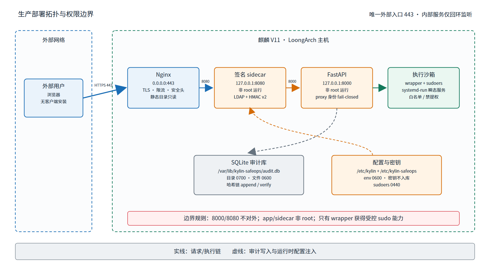

数据目录：审计库 `/var/lib/kylin-safeops/`；配置 `/etc/kylin/`（sidecar）+ `/etc/kylin-safeops/`（app）；前端 `/var/www/kylin-safeops/`。

---

# 17 部署验收清单

> 每项给出验证方式与证据字段。以下 14 项已在麒麟 V11 · LoongArch 目标平台 VM 部署验收通过；命令输出/截图证据由目标平台验证负责人统一归档。

| 编号 | 验收项 | 验证方式（可直接复制执行） | 状态 | 证据 |
|------|--------|--------------------------|:---:|------|
| ACC-01 | 目标平台架构 | `uname -m`（期望：loongarch64） | ✅ |  |
| ACC-02 | 后端进程存活 | `systemctl is-active kylin-safeops`（期望：active） | ✅ | 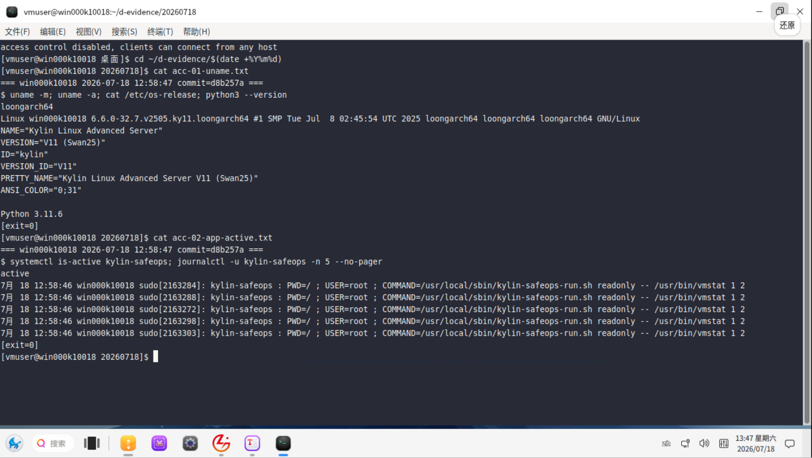 |
| ACC-03 | sidecar 进程存活 | `systemctl is-active kylin-proxy`（期望：active） | ✅ | 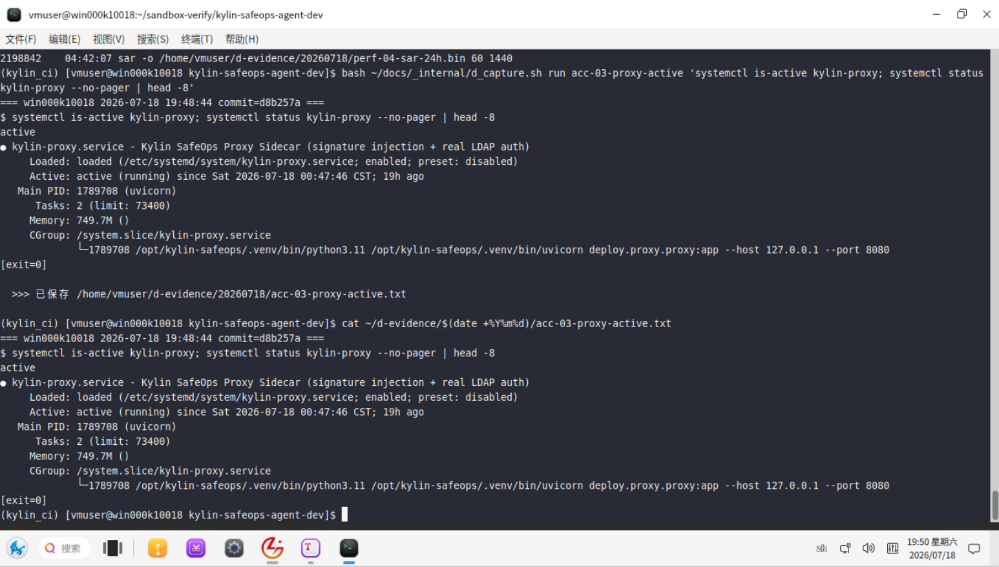 |
| ACC-04 | 端口监听 | `ss -tlnp \| grep -E ':(8000\|8080)'`（期望：两行均含 127.0.0.1） | ✅ | 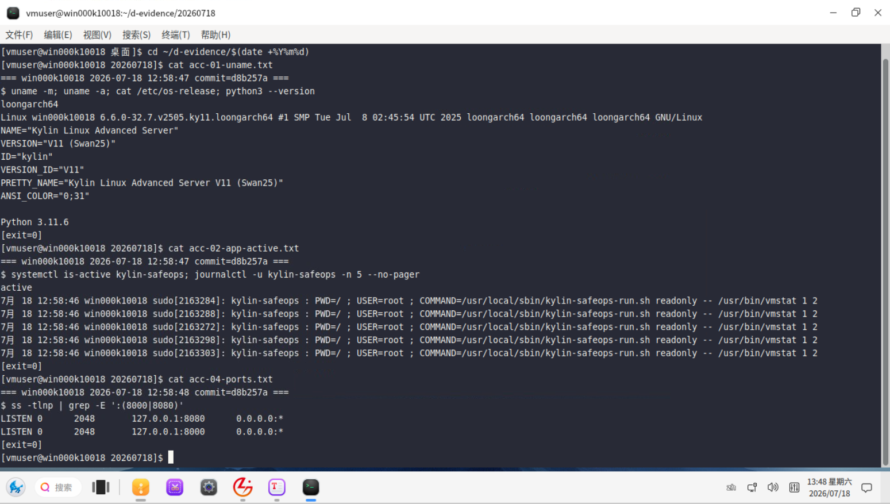 |
| ACC-05 | 后端就绪 | `curl -sf http://127.0.0.1:8000/api/system/ready && echo " app-ready"`（期望：app-ready） | ✅ | 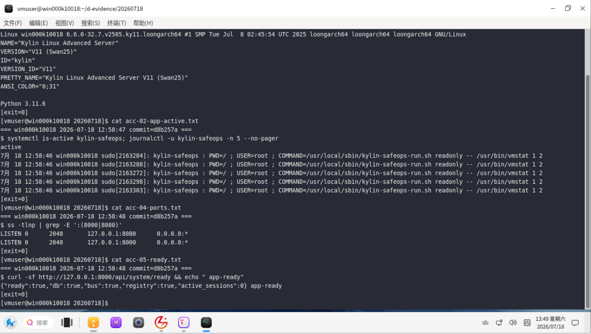 |
| ACC-06 | 前门链路 + 鉴权 | `curl -sk -o /dev/null -w "%{http_code}\n" https://<host>/api/system/overview`（期望：401） | ✅ | 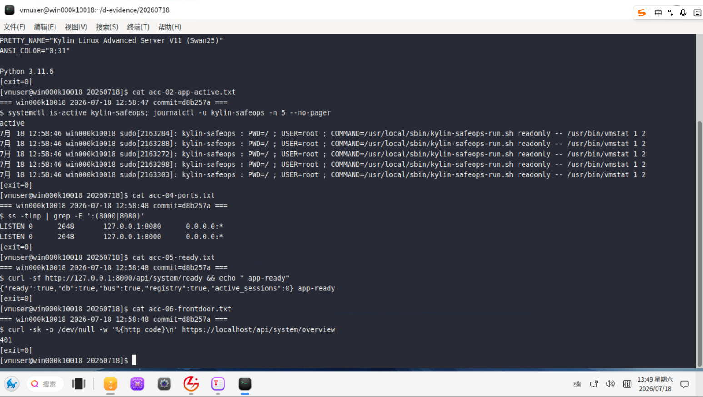 |
| ACC-07 | 工具注册表 | `curl -sfk "https://<host>/api/tools/registry" -u "<ldap_user>" \| python3 -c "import sys,json;d=json.load(sys.stdin);t=d if isinstance(d,list) else d.get('tools',d);print(len(t),'tools')"`（期望：15 tools） | ✅ | 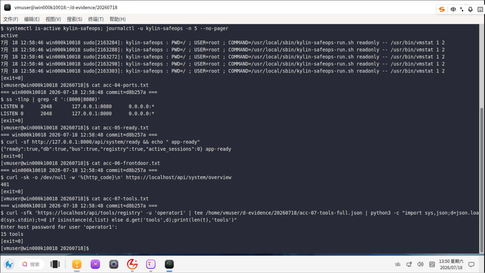 |
| ACC-08 | 审计库与链完整性 | `sudo ls -l /var/lib/kylin-safeops/audit.db`（期望：-rw-------）；`curl -sf -X POST http://127.0.0.1:8000/api/audit/verify`（期望：valid） | ✅ | 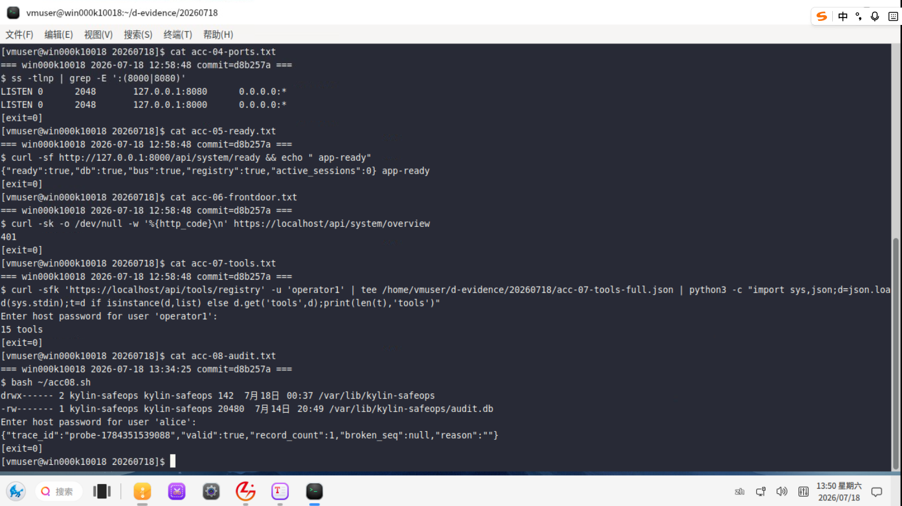 |
| ACC-09 | LLM 端点连通 | `curl -sf "http://127.0.0.1:8000/api/llm/health?probe=true"`（期望：JSON 含 provider=real） | ✅ | 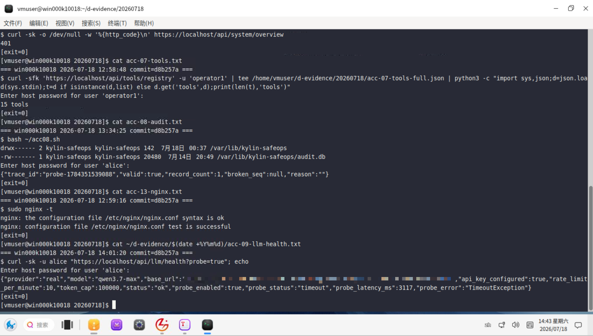 |
| ACC-10 | 高危审批链 | 以 operator 请求 R3 操作（如 service.restart），进入审批等待；以 admin 审批通过后执行成功 | ✅ | 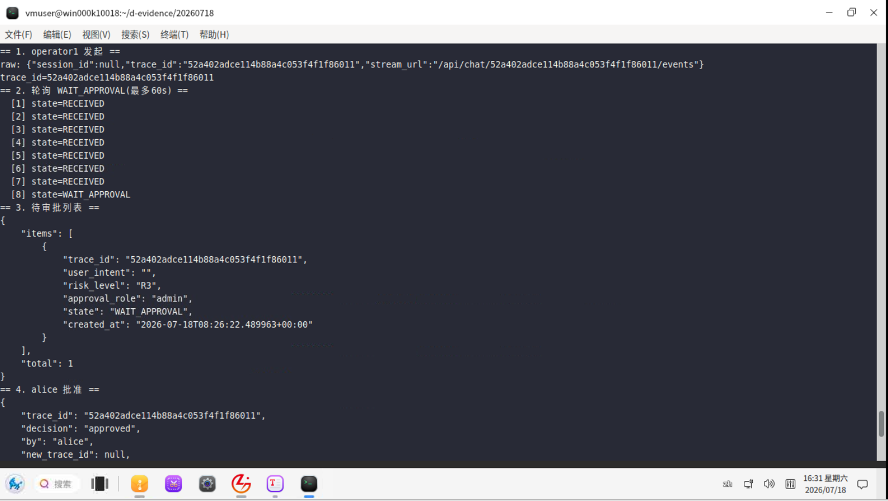<br>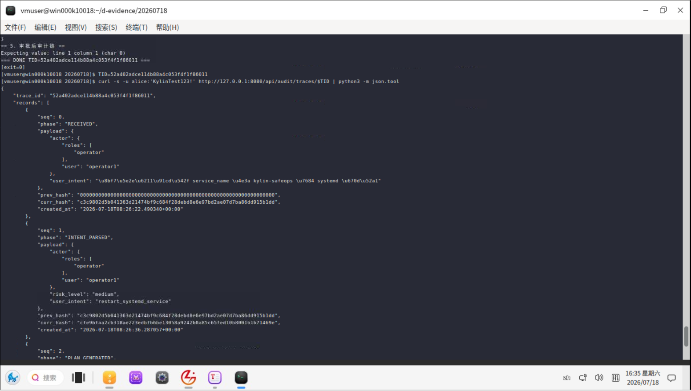<br>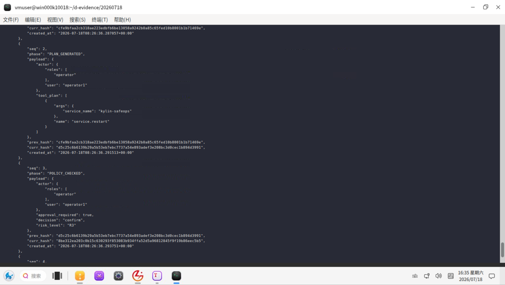<br>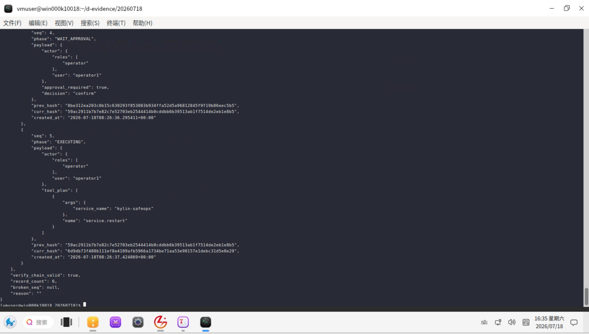 |
| ACC-11 | 沙箱执行 | 执行变更工具后 `journalctl -u "kylin-run-*"` 可见 systemd-run 瞬态单元记录 | ✅ | 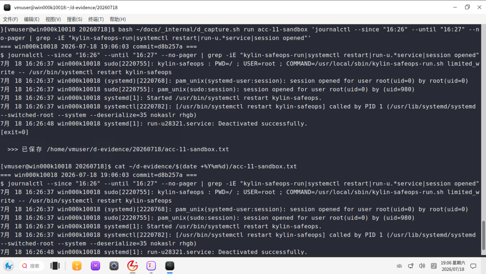 |
| ACC-12 | mock fail-closed | 临时设 `KYLIN_LDAP_MOCK=true` 后 `systemctl restart kylin-safeops`；`journalctl -u kylin-safeops -n 10` 应见拒启日志 | ✅ | 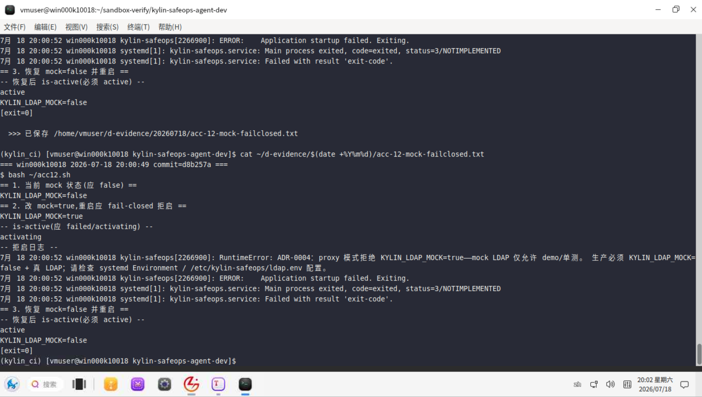 |
| ACC-13 | nginx 配置 | `sudo nginx -t`（期望：syntax is ok + test is successful） | ✅ | 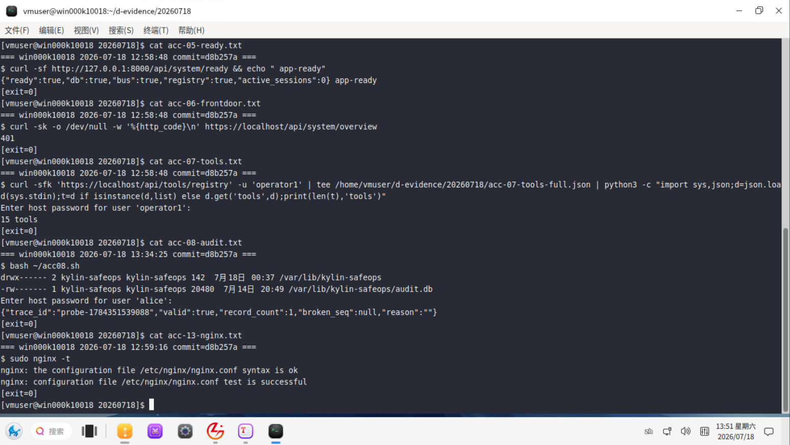 |
| ACC-14 | 备份可恢复 | 恢复审计库备份后 `curl -sf -X POST http://127.0.0.1:8000/api/audit/verify`（期望：valid） | ✅ | 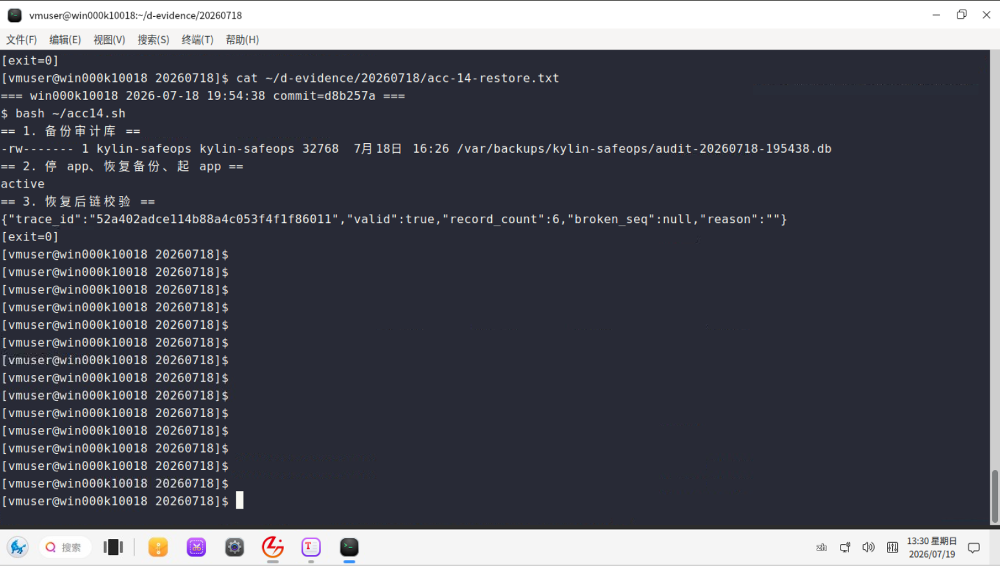 |

---

# 18 发布制品回填清单

| 项 | 说明 | 处置 |
|----|------|------|
| 发布包 SHA256 | 打包后统一生成 | `sha256sum` 回填附录 A（发布前完成） |
| LoongArch wheelhouse | pydantic-core 预编译 wheel | 目标架构 `pip download` 生成后随包分发（§8.1） |
| 离线制品 | wheelhouse + 预构建 dist | 按 §8 预生成后随发布包分发 |
| 目标机 nginx 版本 | 决定 http2 语法 | 部署时 `nginx -v` 判定（§11.2） |

---

# 附录 A SHA256 校验

关键部署制品 SHA256 见 §3.3（基于 commit d8b257a 实测）。**发布包（.zip/.tar.gz）SHA256：待打包后回填**。
校验命令：`sha256sum <文件>`；比对不一致则制品被篡改或版本不符，禁止部署。

# 附录 B 环境变量清单

> 权威来源：`deploy/sso/ldap_client.py`（LDAP 变量）、`backend/app/api/deps.py`（认证模式）、`backend/app/llm/real_client.py`（LLM 变量）。以下清单与源码 `os.environ.get(...)` 实际读取键名完全一致。

## B.1 app 侧（后端进程）

| 变量 | 默认值 | 生产取值 | 敏感 | 说明 |
|------|--------|---------|:---:|------|
| `KYLIN_AUTH_MODE` | `proxy` | `proxy` | | 认证模式；生产必须 proxy |
| `KYLIN_LDAP_MOCK` | `false` | `false` | | true + proxy 模式启动 fail-closed |
| `KYLIN_SANDBOX_ENABLED` | `0` | `1` | | 麒麟 Linux 生产必须 1 |
| `KYLIN_AUDIT_DB` | `./data/audit.db` | `/var/lib/kylin-safeops/audit.db` | | 审计库绝对路径 |
| `KYLIN_NONCE_STORE` | `memory` | `memory`（单机）/ `redis`（多副本） | | |
| `KYLIN_REDIS_URL` | — | `redis://localhost:6379/0` | ✅ | KYLIN_NONCE_STORE=redis 时必设 |
| `KYLIN_MAX_REQUEST_BYTES` | `1048576` | 按需 | | 请求体上限 1MB |
| `KYLIN_SSE_QUEUE_MAX` | `100` | 按需 | | SSE 事件队列上限 |
| `KYLIN_LOG_MODE` | `development` | `production` | | production=JSON formatter |
| `KYLIN_LLM_PROVIDER` | `fixture` | `real` | | fixture=不联网；real=真实端点 |
| `KYLIN_LLM_FAKE` | 不设 | 不设 | | true 时走 fake 桩（生产不设） |
| `KYLIN_LLM_BASE_URL` | `http://localhost:8000/v1` | 真实端点 URL | | OpenAI 兼容 |
| `KYLIN_LLM_MODEL` | `qwen2.5` | `Qwen3.7 系列` | | |
| `KYLIN_LLM_API_KEY` | `""` | 真实 API Key | ✅ | |
| `KYLIN_LLM_TIMEOUT` | `30` | 按需 | | 秒 |
| `KYLIN_LLM_RATE_LIMIT` | `10` | 按需 | | 每分钟限速 |
| `KYLIN_LLM_TOKEN_CAP` | `100000` | 按需 | | token 上限 |
| `KYLIN_PROXY_AUTH_SECRET` | — | 32 字节 hex（与 sidecar 一致） | ✅ | |

## B.2 反代 sidecar 侧（/etc/kylin/proxy.env，权威来源：ldap_client.py）

| 变量 | 必填 | 示例 | 敏感 | 说明 |
|------|:---:|------|:---:|------|
| `KYLIN_LDAP_URL` | ✅ | `ldap://ldap.kylin.local:389` | | ldaps:// 自动启用 TLS |
| `KYLIN_LDAP_BIND_DN` | ✅ | `cn=svc,ou=system,dc=kylin,dc=local` | | 服务账号 DN |
| `KYLIN_LDAP_BIND_PASSWORD` | ✅ | （带外注入） | ✅ | 服务账号口令 |
| `KYLIN_LDAP_BASE_DN` | ✅ | `ou=users,dc=kylin,dc=local` | | 用户搜索基 DN |
| `KYLIN_LDAP_USER_FILTER` | ✅ | `(uid={0})` 或 `(uid={})` | | **占位符必须为 `{0}` 或 `{}`**（Python `.format(escaped_user)`），`{username}` 是错误写法会报 KeyError |
| `KYLIN_LDAP_GROUP_ATTR` | ✅ | `memberOf` | | 用户对象上的组属性名 |
| `KYLIN_LDAP_GROUP_ROLE_MAP` | | `{"kylin-admins":"admin","kylin-ops":"operator","kylin-auditors":"auditor"}` | | 缺省使用内置映射，填 JSON 覆盖 |
| `KYLIN_LDAP_USE_TLS` | | `false` | | true 或 ldaps:// 时启用 TLS + CERT_REQUIRED |
| `KYLIN_LDAP_CA_CERT` | | `/etc/ssl/certs/ca.pem` | | TLS 启用时可选指定 CA bundle |
| `KYLIN_UPSTREAM` | ✅ | `http://127.0.0.1:8000` | | app 上游地址 |
| `KYLIN_PROXY_AUTH_SECRET` | ✅ | 32 字节 hex | ✅ | 与 app 侧必须完全一致（含大小写） |
| `KYLIN_LDAP_MOCK` | | `false` | | 生产必须 false |

> **安全提示**：`KYLIN_LDAP_BIND_PASSWORD` 和 `KYLIN_PROXY_AUTH_SECRET` 绝不进入 Git / 日志 / 前端。proxy.env 权限 `0600`，所有者 `root:kylin-safeops`。

# 附录 C 端口清单

| 端口 | 用途 | 监听 |
|------|------|------|
| 443 | HTTPS 对外 | 0.0.0.0 |
| 8080 | 反代 sidecar | 127.0.0.1 |
| 8000 | FastAPI 后端 | 127.0.0.1 |
| 389/636 | LDAP | 按部署 |

# 附录 D 路径清单

见 §2.2 安装后目录与权限表。

# 附录 E 缩略语

| 缩写 | 含义 |
|------|------|
| ACC | Acceptance，部署验收项编号 |
| HMAC | 基于哈希的消息认证码（反代签名） |
| LDAP | 轻量目录访问协议 |
| NNP | NoNewPrivileges（systemd 禁提权属性） |
| TLS | 传输层安全 |
| SSE | 服务端推送事件 |

# 附录 F 参考文件

- `deploy/install.sh`、`deploy/kylin-safeops.service`、`deploy/proxy/kylin-proxy.service`、`deploy/nginx.conf`、`deploy/sandbox/kylin-safeops-run.sh`、`deploy/sandbox/kylin-safeops-sudoers`、`deploy/sso/ldap_client.py`
- 《软件安装包及部署文档》配套：`FACTS.md`、`evidence/12-deploy-factcheck.md`

---

*本部署文档版本 V1.1，基于 commit d8b257a，与 deploy/ 实际文件逐一核对。*

---

# 图索引

| 图号 | 图名 | 章节 |
|------|------|------|
| 图 16-1 | 部署拓扑图 | §16 |
