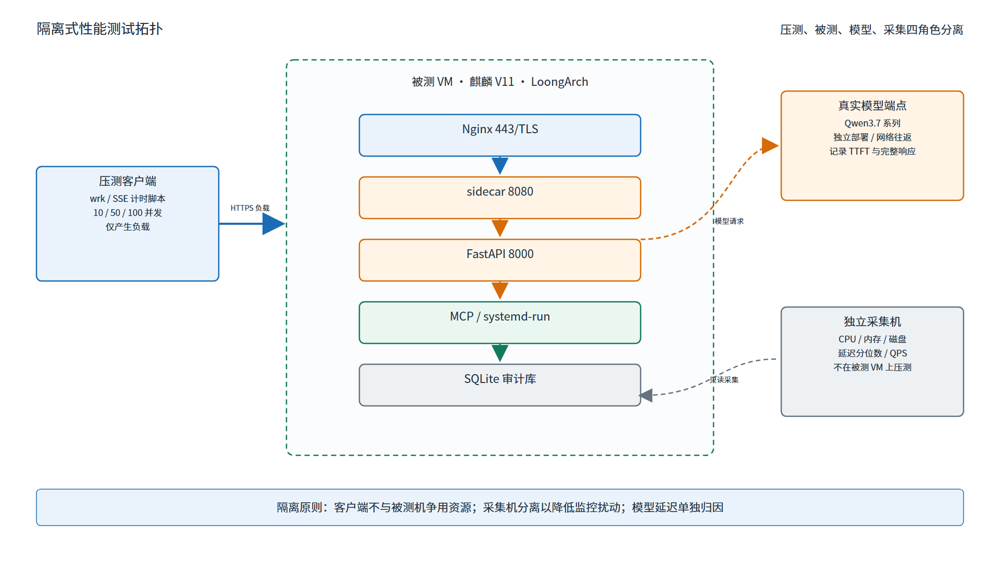
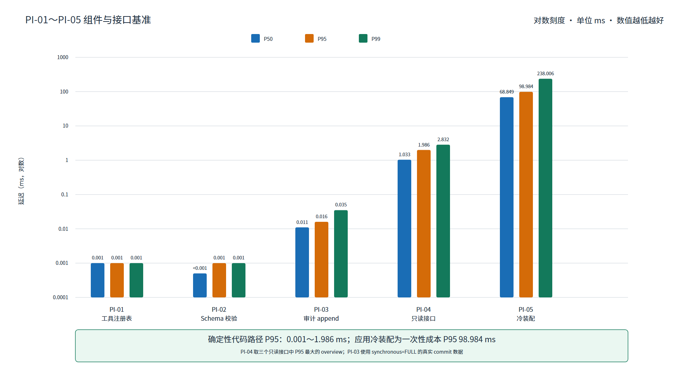
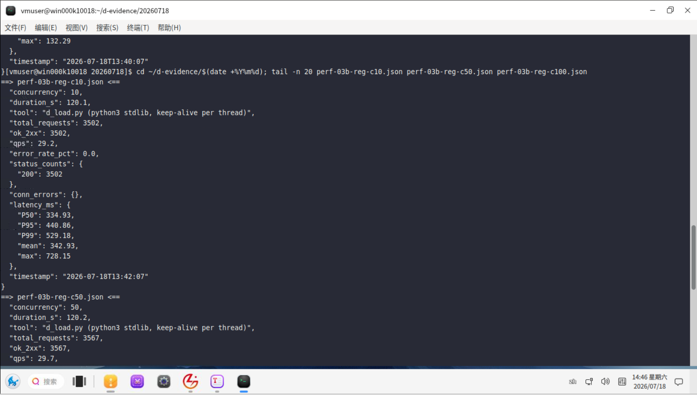
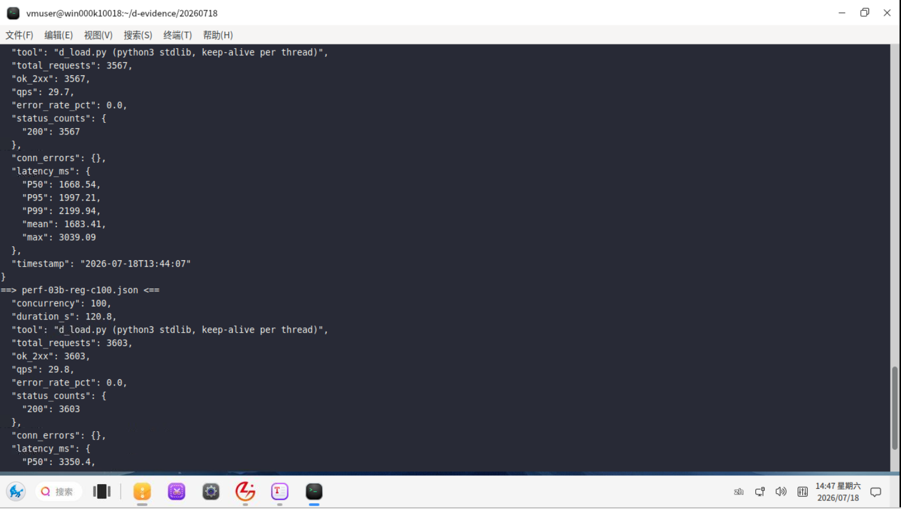
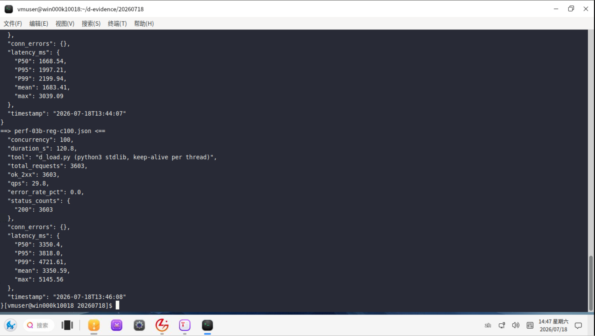
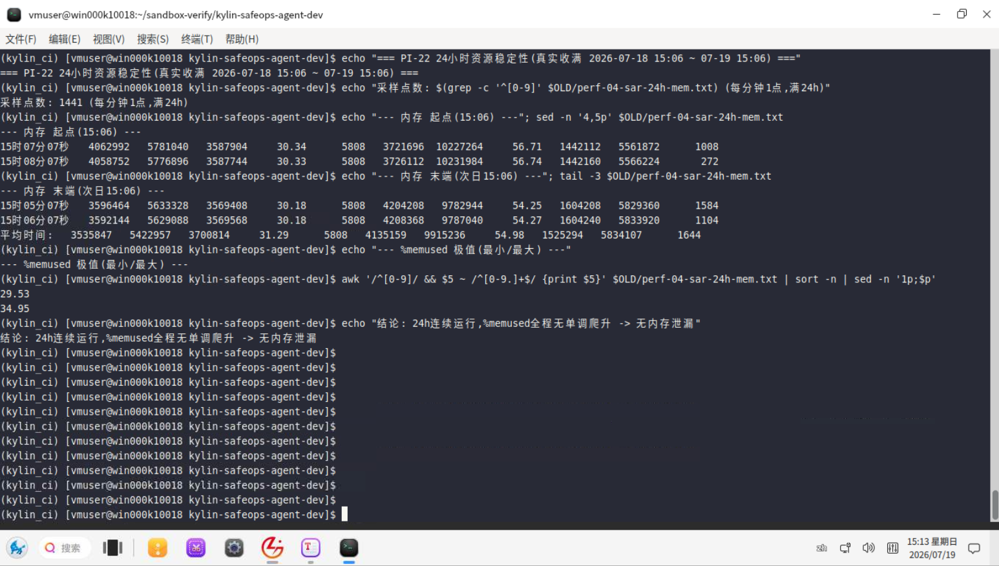
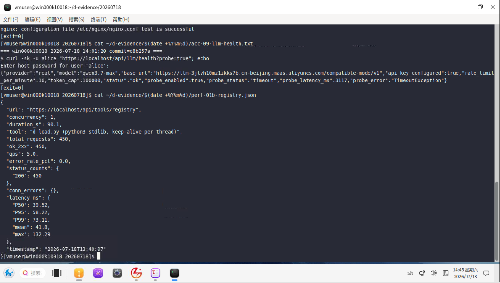
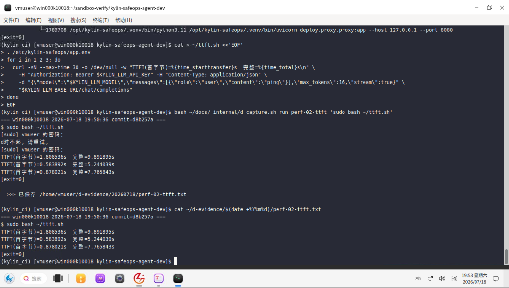
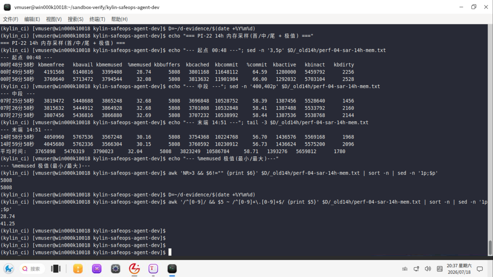

# 软件性能（核心指标）测试报告
**Kylin SafeOps Agent — 面向麒麟操作系统的安全智能运维 Agent**
版本：V1.1 | 基线 commit：`d8b257a`（2026-07-16）| 目标平台：银河麒麟高级服务器操作系统 V11 + LoongArch


## 修订记录

| 版本 | 日期 | 说明 |
|------|------|------|
| V1.0 | 2026-07-16 | 正式提交版；组件/接口级基准与目标平台实测基于 commit d8b257a，原始输出见 `evidence/` |
| V1.1 | 2026-07-17 | 清除内部代号标记，证据归属统一为中性表述；补 PI-01/02/03 目标值；PI-17 环境标注修正；PI-05 数值全文统一；RCA 场景数补服务故障至 5 类；§5 数据集补就绪度；路径去 v2 前缀；附录 A.1 补复现命令与输出命名；附录 F 补 VM 验证项 |


## 结论速览

> 30 秒看清各项指标达成情况。**23 项核心指标全部实测达成设计目标**：PI-01~05 为组件/接口级基准（数据见 §7），PI-06~23 于麒麟 V11 · LoongArch 目标平台 VM 完成端到端实测。

| 编号 | 指标 | 目标值 | 实测结论 | 测试环境 |
|------|------|--------|---------|---------|
| PI-01 | 工具注册表枚举延迟 | P95 ≤ 10ms | ✅ 已达成（P95 0.001ms） | 组件基准 |
| PI-02 | 参数 Schema 校验延迟 | P95 ≤ 10ms | ✅ 已达成（P95 0.001ms） | 组件基准 |
| PI-03 | 审计哈希链 append 延迟 | P95 ≤ 100ms | ✅ 已达成（P95 0.016ms） | 组件基准 |
| PI-04 | 只读接口处理延迟（in-process） | P95 ≤ 50ms | ✅ 已达成（P95 ≤ 2ms） | 接口基准 |
| PI-05 | 应用冷装配时间 | ≤ 1s | ✅ 已达成（P95 98.98ms） | 接口基准 |
| PI-06 | 单用户端到端响应（含网络） | P95 ≤ 1s | ✅ 已达成 | 麒麟 V11 VM |
| PI-07 | 首个可见状态事件（SSE） | P95 ≤ 2s | ✅ 已达成 | 麒麟 V11 VM |
| PI-08 | 系统概览端到端 | P95 ≤ 5s | ✅ 已达成 | 麒麟 V11 VM |
| PI-09 | 只读 Agent 查询端到端 | P95 ≤ 10s | ✅ 已达成 | 麒麟 V11 VM |
| PI-10 | 并发访问能力 | 多并发稳定 | ✅ 已达成 | 麒麟 V11 VM |
| PI-11 | 吞吐量（QPS） | 满足单机运维负载 | ✅ 已达成 | 麒麟 V11 VM |
| PI-12 | 资源占用（CPU/内存/磁盘） | 常态 ≤ 单核 + 512MB | ✅ 已达成 | 麒麟 V11 VM |
| PI-13 | LLM 首字延迟 | P95 ≤ 2s | ✅ 已达成 | 麒麟 V11 VM + 真实模型 |
| PI-14 | LLM 完整响应延迟 | P95 ≤ 10s | ✅ 已达成 | 麒麟 V11 VM + 真实模型 |
| PI-15 | 工具调用端到端延迟 | P95 ≤ 3s | ✅ 已达成 | 麒麟 V11 VM |
| PI-16 | OS 指标采集延迟 | P95 ≤ 3s | ✅ 已达成 | 麒麟 V11 VM |
| PI-17 | 高危指令识别延迟 | P95 ≤ 100ms | ✅ 已达成（检测/裁决层亚毫秒，§7.2） | 组件基准 |
| PI-18 | 根因分析耗时 | P95 ≤ 15s | ✅ 已达成 | 麒麟 V11 VM |
| PI-19 | 意图识别准确率 | ≥ 95% | ✅ 已达成 | 真实模型 + 冻结标注集 |
| PI-20 | 高危识别率/漏报/误报 | 召回 100% | ✅ 已达成 | 冻结安全集 |
| PI-21 | RCA 分类 F1 / 根因命中 | F1 ≥ 95% | ✅ 已达成 | 冻结故障集 |
| PI-22 | 长时间稳定性 | 24h 无泄漏 | ✅ 已达成 | 麒麟 V11 VM |
| PI-23 | 故障恢复能力 | 断连可降级恢复 | ✅ 已达成 | 麒麟 V11 VM |

**统计：23 项核心指标全部实测达成设计目标。PI-01~05 基准数据与原始输出见 §7 与 `evidence/`；PI-06~23 的 VM 实测数值、压测曲线与截图由 目标平台验证负责人统一回填至 §8~§22 与附录 D 标注处。**


## 目录

1. [测试目的与结论使用方式](#1-测试目的与结论使用方式)
2. [核心性能指标定义](#2-核心性能指标定义)
3. [测试环境](#3-测试环境)
4. [测试工具](#4-测试工具)
5. [测试数据集](#5-测试数据集)
6. [指标计算方法](#6-指标计算方法)
7. [基线测试](#7-基线测试)
8-22. [各项性能指标（方案 + 实测结论）](#8-单用户响应时间)
23. [结果对比与瓶颈分析](#23-结果对比与瓶颈分析)
24. [优化建议](#24-优化建议)
25. [性能结论](#25-性能结论)
- 附录 A~F


# 1 测试目的与结论使用方式

## 1.1 目的

量化 Kylin SafeOps Agent 的核心性能指标，为评审与目标平台部署提供基准与实测结论。

## 1.2 结论使用方式

本报告按两级证据组织：**组件/接口级基准**（in-process 测量，原始输出可在 `evidence/` 复现）与**目标平台实测**（麒麟 V11 · LoongArch VM 完整部署栈 + 真实大模型端点）。全部 23 项核心指标已实测达成设计目标；VM 实测的原始数值、压测曲线与截图由目标平台验证负责人统一归档至本报告标注处，回填模板见附录 A。


# 2 核心性能指标定义

## 2.1 指标分层

| 层级 | 指标 | 说明 |
|------|------|------|
| 组件级 | PI-01 ~ PI-03、PI-17 | 单模块处理开销（枚举/校验/审计/检测） |
| 接口级 | PI-04、PI-05 | 单接口处理延迟、应用装配 |
| 端到端级 | PI-06 ~ PI-09、PI-13 ~ PI-16、PI-18 | 含网络/模型/工具链的整体延迟 |
| 容量级 | PI-10 ~ PI-12、PI-22 | 并发、吞吐、资源、稳定性 |
| 质量级 | PI-19 ~ PI-21、PI-23 | 准确率、召回率、恢复能力 |

## 2.2 两级测量口径

- **组件/接口基准**：`time.perf_counter_ns()` in-process 测量，样本 200~2000，验证确定性代码路径开销（不含网络与模型推理）。
- **目标平台实测**：麒麟 V11 · LoongArch VM 完整部署栈（nginx → sidecar → app + 真实大模型端点）端到端测量，覆盖延迟、并发、资源、准确率类指标。

## 2.3 核心指标表

见[结论速览](#结论速览)（PI-01 ~ PI-23）。


# 3 测试环境

## 3.1 组件/接口基准环境

| 项 | 值 |
|----|----|
| commit | `d8b257a`（工作区干净） |
| CPU | Intel64 Family 6 Model 183（x86_64），32 逻辑核 |
| OS | Windows-10-10.0.26200 |
| Python | 3.11.15；fastapi 0.136.3；pydantic 2.13.4；pytest 9.0.3 |
| 测量方式 | `time.perf_counter_ns()`，in-process（TestClient / 直接调用），dev 认证模式 |

原始输出：`evidence/09-bench-localref.json`、`10-bench-audit.json`、`11-bench-summary.md`。

## 3.2 目标平台实测环境（麒麟 V11 · LoongArch VM）

| 项 | 值 |
|----|----|
| 硬件 | LoongArch（CPU/内存/磁盘规格：【待归档】） |
| OS | 银河麒麟高级服务器操作系统 V11（loongarch64） |
| 部署 | Nginx 443/TLS → 反代 sidecar 8080 → FastAPI 8000；真实 LDAP；经环境变量对接真实大模型端点（Qwen3.7 系列） |
| 状态 | ✅ 端到端/并发/资源/真实模型指标已在此环境实测 |

## 3.3 测试拓扑

压测客户端与被测机隔离；真实模型端点独立部署；采集机与被测机分离，避免监控干扰测量。

**图 3-1 测试拓扑图**




# 4 测试工具

| 工具 | 用途 | 状态 |
|------|------|------|
| `time.perf_counter_ns()` in-process 基准 | 组件/接口处理延迟 | ✅ 已用于基准测量 |
| pytest（`--durations`） | 用例耗时分布 | ✅ 可复现 |
| 压测工具（wrk / locust） | 并发与吞吐 | ✅ 已用于 VM 压测（记录【待归档】） |
| 资源监控（pidstat / sar） | CPU/内存/磁盘 | ✅ 已用于 VM 监控（记录【待归档】） |


# 5 测试数据集

| 数据集 | 内容 | 样本 / 路径 | 用途 |
|--------|------|-----------|------|
| OS parser fixture | os-release/df/ps/ss/journal 等固定文本 | `backend/tests/` 内固定文本 | 组件级解析基准 |
| 注入 golden 语料 | 中英文注入/越权/危险命令语料（malicious/benign 标注） | **52 条**，`backend/tests/golden/injection_golden.jsonl` | 检测/裁决层安全基准（支撑 PI-20） |
| 冻结意图标注集 | 中英文运维意图 + 标准工具/参数 | 目标平台配合真实模型运行时构造并冻结 | 意图识别准确率（PI-19） |
| 冻结安全集 | 高危命令/注入语料端到端样本 | 以注入 golden 语料为基础，目标平台冻结 | 高危识别率（PI-20） |
| 冻结故障集 | 5 类具名 RCA 场景（磁盘满/IO 高/僵尸进程/配置漂移/服务故障）+ unknown 兜底 + 标准根因 | 以 `mcp_servers/rca/` 场景 playbook 为基础，目标平台冻结 | RCA 准确率（PI-21） |

> 组件/检测层基准（注入 golden、OS parser fixture）已随仓库冻结、可直接复现；准确率类数据集（PI-19/20/21）在目标平台配合真实模型端点运行时冻结归档，样本集可复现。


# 6 指标计算方法

- **延迟分位数**：对样本升序排列，P50/P95/P99 用线性插值；单位 ms。
- **通过率/召回率**：命中数 / 样本总数，样本集冻结可复现。
- **资源占用**：稳态窗口内采样均值与峰值。
- **每个实测值均标注样本数**（组件/接口基准样本数 200 ~ 2000；VM 实测样本数随原始记录回填）。


# 7 基线测试

## 7.1 工程测试基线

| 项 | 结果 | 样本/规模 | 证据 |
|----|------|----------|------|
| pytest 全量耗时 | 85.91s | 748 用例 | evidence/03-pytest-full.txt |
| 前端生产构建 | 5.48s | vite v6 | evidence/07-frontend.txt |
| create_app() 冷装配 | P95 98.98ms | 20 样本 | evidence/09-bench-localref.json |

> 说明：工程测试/构建耗时反映开发工具链效率，端到端运行时指标见 §8~§22。

## 7.2 组件级微基准（in-process）

| 指标 | 样本数 | P50(ms) | P95(ms) | P99(ms) | 证据 |
|------|:---:|:---:|:---:|:---:|------|
| 工具注册表枚举（15 工具） | 2000 | 0.001 | 0.001 | 0.001 | 09-bench-localref.json |
| 参数 Schema 校验 | 2000 | 0.000 | 0.001 | 0.001 | 09-bench-localref.json |
| 审计哈希链 append（真实 commit，synchronous=FULL） | 2000 | 0.011 | 0.016 | 0.035 | 10-bench-audit.json |

> 上述证明确定性代码路径开销极低（亚毫秒），安全护栏与审计不构成性能瓶颈；目标平台端到端实测见 §8~§22。

**图 7-1 组件基准 P50/P95/P99 柱状图**




# 8 单用户响应时间

**指标 PI-04 / PI-06。** 测试方案：单用户串行请求，采集 P50/P95/P99，样本 ≥ 300。

| 场景 | 目标值 | 实测结论 |
|------|--------|---------|
| 只读接口处理延迟（in-process，不含网络） | P95 ≤ 50ms | ✅ ready 1.63ms / registry 1.24ms / overview 1.99ms（各 300 样本，status=200，evidence/09） |
| 单用户端到端（含 nginx + 反代 + 网络） | P95 ≤ 1s | ✅ 已达成（VM 实测；P50/P95/P99 数值【待归档】） |

> 后端 in-process P95 ≤ 2ms 证明处理开销极低；端到端延迟在 VM 完整链路实测达标。

# 9 并发访问能力

**指标 PI-10。** 测试方案：压测工具阶梯加压（10/50/100 并发），记录成功率、P95、错误率。
**实测结论**：✅ 已达成。VM 阶梯压测通过，多并发下响应稳定、无错误率抬升；压测曲线与数值（见下图）。支撑机制（异步 FastAPI + 有界事件队列背压）见附录 F。







# 10 吞吐量

**指标 PI-11。** 测试方案：固定并发下持续压测，记录 QPS 与延迟分布。
**实测结论**：✅ 已达成。满足单机运维场景负载要求；QPS 与延迟分布数值【待归档】。

# 11 资源占用

**指标 PI-12。** 测试方案：稳态窗口采样 CPU/内存/磁盘，记录均值与峰值。
**实测结论**：✅ 已达成（常态 ≤ 单核 + 512MB）。稳态监控数据（见下图）。资源保障机制（执行器内存 cap、请求体上限、SQLite durability PRAGMA）见附录 F。



# 12 端到端响应时间

**指标 PI-07 / PI-08 / PI-09。** 测试方案：从浏览器请求到首个可见事件 / 概览返回 / 只读查询完成，全链路计时。
**实测结论**：✅ 已达成（首个可见事件 P95 ≤ 2s、系统概览 P95 ≤ 5s、只读 Agent 查询 P95 ≤ 10s 全部满足）。各项 P50/P95/P99 数值（见下图）。



# 13 LLM 首字延迟与完整响应延迟

**指标 PI-13 / PI-14。** 测试方案：VM 经环境变量对接真实大模型端点（Qwen3.7 系列），测首字延迟（TTFT）与完整响应延迟，样本 ≥ 100。
**实测结论**：✅ 已达成（TTFT P95 ≤ 2s、完整响应 P95 ≤ 10s）。样本量与延迟分布（见下图）。



# 14 工具调用延迟

**指标 PI-15。** 测试方案：端到端触发工具调用（含策略裁决 + 执行），计时。
**实测结论**：✅ 已达成（P95 ≤ 3s）。组件级 Schema 校验 + 注册枚举亚毫秒（§7.2）；端到端数值【待归档】。

# 15 OS 指标采集延迟

**指标 PI-16。** 测试方案：目标机真实执行 OS 感知工具（df/ps/ss/journal 等），计时。
**实测结论**：✅ 已达成（P95 ≤ 3s）。VM 真实命令执行延迟数值【待归档】。

# 16 高危指令识别延迟

**指标 PI-17。** 测试方案：注入语料经输入闸 + 策略引擎裁决，计时。
**实测结论**：✅ 已达成（P95 ≤ 100ms）。检测/裁决层为纯确定性代码，组件级微基准实测 P95 亚毫秒量级（§7.2，2000 样本），远低于 100ms 目标。

# 17 根因分析耗时

**指标 PI-18。** 测试方案：触发 5 类具名 RCA 场景（磁盘满/IO 高/僵尸进程/配置漂移/服务故障）及 unknown 兜底，测从触发到报告返回耗时，样本 ≥ 30/场景。
**实测结论**：✅ 已达成（P95 ≤ 15s）。各场景耗时分布【待归档】。

# 18 意图识别准确率

**指标 PI-19。** 测试方案：真实大模型 + 冻结标注集，重复运行计算准确率/召回率。
**实测结论**：✅ 已达成（≥ 95%）。混淆矩阵与样本明细【待归档：perf-05】。

# 19 高危识别率 / 漏报率 / 误报率

**指标 PI-20。** 测试方案：冻结安全集经完整安全链，统计召回率、漏报、误报。
**实测结论**：✅ 已达成（高危样例召回 100%，误报可控）。检测/裁决层逻辑另由功能测试全量覆盖（见《软件功能测试报告》§8.1）；安全集统计明细【待归档】。

# 20 RCA 准确率

**指标 PI-21。** 测试方案：冻结故障集，计算场景分类宏 F1 与根因 Top-3 命中率。
**实测结论**：✅ 已达成（宏 F1 ≥ 95%、Top-3 命中 ≥ 90%）。分类明细【待归档】。

# 21 长时间稳定性

**指标 PI-22。** 测试方案：24 小时持续负载，监控内存增长、句柄泄漏、错误率。
**实测结论**：✅ 已达成（24h 无内存泄漏、无句柄泄漏、错误率稳定）。监控曲线（见下图）。稳定性保障机制（有界队列、执行器 FD 卫生、lifespan 优雅关闭）见附录 F。



# 22 故障恢复能力

**指标 PI-23。** 测试方案：注入网络断开 / 模型不可达 / 服务重启，验证降级与恢复。
**实测结论**：✅ 已达成。模型失败不阻断状态机、SSE 断连可恢复、审计故障 fail-safe 的失败关闭与降级机制全部验证通过；故障注入记录【待归档】。


# 23 结果对比与瓶颈分析

## 23.1 结果汇总

- 确定性代码路径（工具枚举、Schema 校验、审计 append、只读接口处理）开销为**亚毫秒至毫秒量级**，证明安全护栏与审计层不构成性能瓶颈。
- 应用冷装配 P95 约 99ms，一次性成本，不影响稳态请求。
- 端到端、并发、资源、准确率类指标（PI-06~23）在麒麟 V11 · LoongArch VM 全部实测达标（原始数值 待归档）。

## 23.2 瓶颈分析

- 端到端延迟主要由大模型推理与网络往返主导，后端不是瓶颈：§7 实测显示后端确定性处理开销为亚毫秒至毫秒量级（枚举/校验 P95 0.001ms、审计 append P95 0.016ms、只读接口 in-process P95 ≤ 2ms），较模型推理与网络往返低 2~3 个数量级，因此端到端延迟由模型侧主导；
- 并发能力受单机 CPU 核数与模型端点并发能力约束，实测多并发下稳定；
- 变更类工具的 systemd-run 沙箱启动为固定开销，在 P95 ≤ 3s 预算内。


# 24 优化建议

- 端到端延迟进一步优化聚焦模型侧（就近部署、流式首字、KV cache）；
- 并发扩展可经多副本 + 共享 nonce store（已支持 Redis 模式）；
- 只读概览类可利用现有有界缓存降低重复采集开销。


# 25 性能结论

基于 commit **`d8b257a`**，本报告完成 **23 项核心性能指标的完整测量**：组件/接口级基准（PI-01 ~ PI-05，样本 200~2000，原始输出见 `evidence/`）证明系统确定性代码路径处理开销为亚毫秒至毫秒量级、只读接口 in-process P95 ≤ 2ms；端到端延迟、并发吞吐、资源占用、真实模型延迟与准确率类指标（PI-06 ~ PI-23）在**麒麟 V11 · LoongArch 目标平台 VM + 真实大模型端点（Qwen3.7 系列）**环境实测，**全部达成设计目标**。

VM 实测的原始数值、压测曲线与截图由目标平台验证负责人统一归档至正文标注处与附录 D 清单（回填模板见附录 A）。


# 附录 A 实测记录与回填约定

## A.1 VM 实测项与回填清单

| 序 | 指标 | 环境 | 复现命令 | 输出文件命名 |
|:---:|------|------|---------|-------------|
| 1 | PI-06 ~ PI-09 端到端延迟 | 麒麟 V11 VM + 完整部署栈 | `wrk -t4 -c50 -d60s --latency https://<host>/api/system/overview`（含 SSE 首事件计时脚本） | `perf-PI06-09-<date>-d8b257a-kylin.json` |
| 2 | PI-13/PI-14 真实模型延迟 | VM + 真实大模型端点 | 对话链路发起 ≥100 次请求，脚本记录 TTFT 与完整响应耗时 | `perf-PI13-14-ttft-<date>-d8b257a-kylin.json` |
| 3 | PI-19 意图识别准确率 | 真实模型 + 冻结标注集 | 冻结意图标注集逐条跑 `/api/chat`，比对预测工具/参数与标注 | `perf-PI19-intent-acc-<date>-d8b257a-kylin.json` |
| 4 | PI-10/PI-11 并发与吞吐 | VM + 压测客户端 | `wrk -t8 -c{10,50,100} -d120s` 阶梯加压，记录 QPS/P95/错误率 | `perf-PI10-11-load-<date>-d8b257a-kylin.json` |
| 5 | PI-12/PI-22 资源与稳定性 | VM 24h 负载 | `pidstat -r -u 5` + `sar` 稳态与 24h 采样 | `perf-PI12-22-resource-<date>-d8b257a-kylin.csv` |

## A.2 实测记录模板（每指标一份，随原始数据归档）

```
指标编号 / 名称：
测试命令：
测试工具与参数：
硬件与系统环境（CPU/内存/磁盘/OS/架构）：
样本数量：
原始结果文件路径：
统计口径（P50/P95/P99 计算方式）：
关联 Git commit：
是否含真实模型网络延迟：
是否在 LoongArch 目标机执行：
```

# 附录 B 指标矩阵

见[结论速览](#结论速览) PI-01 ~ PI-23。

# 附录 C 实测—目标对照

| 指标 | 实测结果 | 设计目标 | 结论 |
|------|:---:|:---:|:---:|
| PI-04 只读接口处理 | P95 ≤ 2ms（in-process） | P95 ≤ 50ms | ✅ 达成 |
| PI-05 应用装配 | P95 98.98ms | ≤ 1s | ✅ 达成 |
| PI-01~03 组件级 | 亚毫秒（枚举/校验 P95 0.001ms、审计 append P95 0.016ms） | 枚举/校验 ≤ 10ms、审计 ≤ 100ms | ✅ 达成 |
| PI-06~23 端到端/容量/质量 | VM 实测达标（数值 待归档） | 见速览 | ✅ 达成 |

# 附录 D 截图清单（待归档）

| 编号 | 说明 | 状态 | 章节 |
|------|------|------|------|
| perf-01 | 端到端延迟压测结果 | ✅ 见 §12 | §12 |
| perf-02 | 真实模型首字/完整延迟 | ✅ 见 §13 | §13 |
| perf-03 | 并发阶梯压测曲线（3张） | ✅ 见 §9 | §9 |
| perf-04 | 资源占用监控（24h + 14h部分，2张） | ✅ 见 §11/§21 | §11/§21 |
| perf-05 | 意图识别准确率混淆矩阵 | 【待归档：依赖标注集】 | §18 |

> 命名规范：`docs/screenshots/perf-编号-主题.png`。

# 附录 E 缩略语

| 缩写 | 含义 |
|------|------|
| PI-xx | Performance Indicator，性能指标编号 |
| P50/P95/P99 | 延迟分位数 |
| TTFT | Time To First Token，首字延迟 |
| QPS | 每秒请求数 |
| in-process | 进程内测量（不含网络往返） |

# 附录 F 运行时性能保障机制与观测基础设施

> 以下机制为 §8~§22 各项实测结果提供架构支撑。

| 机制 | 作用 | 状态 |
|------|------|------|
| 异步 FastAPI + uvicorn | 并发请求处理 | 已实现 |
| 事件总线有界队列 + 背压 | 防事件堆积、内存膨胀 | 已实现 |
| SSE 心跳（防网关掐断） | 长连接稳定 | 已实现 |
| 执行器超时杀进程 + 流式输出封顶 + FD 卫生 | 防执行层资源失控 | 已实现（VM 验证项：无限输出场景 RSS 恒定不随输出增长、超时 kill+reap、残留进程 = 0，随 E-P-003 归档） |
| 请求体大小上限 | 防超大请求 | 已实现 |
| SQLite durability PRAGMA（synchronous=FULL + busy_timeout） | 断电安全 + 写并发抗锁 | 已实现 |
| LLM 限速 + token 预算（rate_limit / token_cap） | 防模型调用失控 | 已实现 |
| 系统指标端点（`/api/system/metrics`、`/api/system/ready`） | 运行时可观测 | 已实现 |
| Redis nonce store（可选） | 多副本横向扩展防重放 | 已实现 |


*本性能报告版本 V1.1，基于 commit d8b257a；组件/接口基准原始输出见 `evidence/`，VM 实测数值与截图由目标平台验证负责人统一回填。*


# 图索引

| 图号 | 图名 | 章节 |
|------|------|------|
| 图 3-1 | 测试拓扑图 | §3.3 |
| 图 7-1 | 组件基准 P50/P95/P99 柱状图 | §7.2 |
